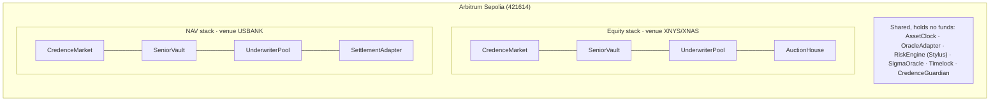
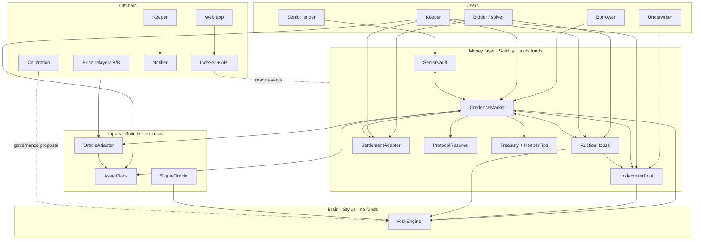
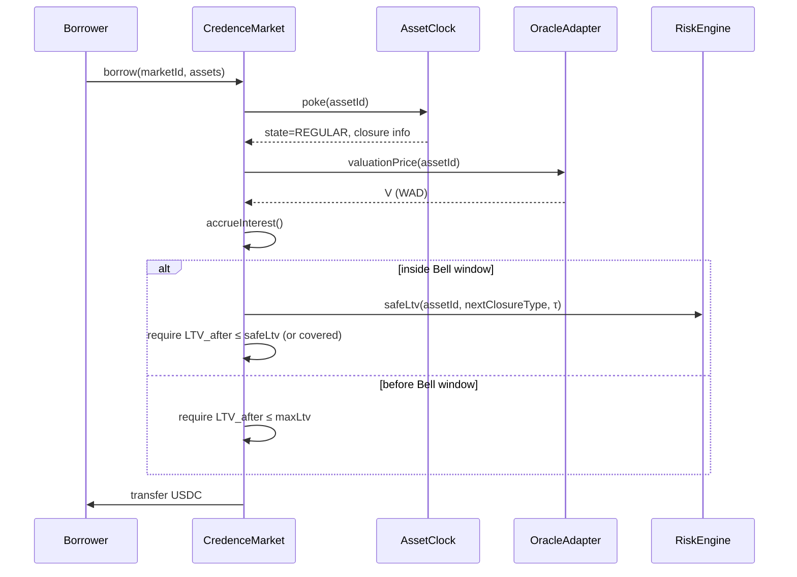
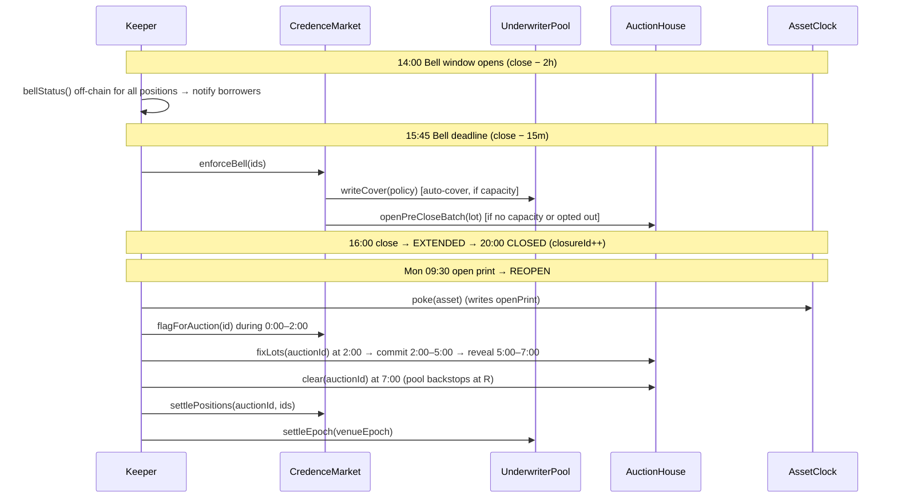
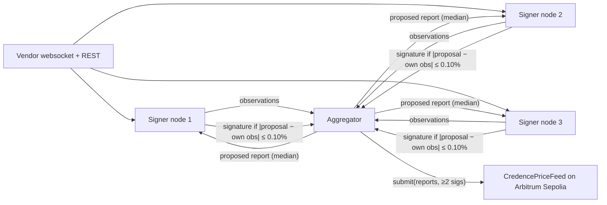

# Credence Finance: Engineering Build Guide

**Target:** Arbitrum Sepolia (chain id `421614`) public testnet, built to mainnet quality
**Version:** 1.1 · Sep 28, 2026 (changelog below)
**Audience:** Solidity engineers, Rust/Stylus engineers, backend engineers, frontend engineers, the quant, DevOps, and audit prep
**Source specs:** `Architecture.md` (Rev 2), `One week of money in Credence Finance.md` (scenario A), `One week of money flow.md` (scenario B)
**Status:** Approved for build. Section 2 lists every decision that refines or overrides the source specs.

**Changelog**
- **v1.1 (Sep 28, 2026), after the Sprint 1 review.**
  - R-22 is corrected: the loss model floors the price at zero, so loss ≤ debt (F-4.3, F-4.4). Premium golden values change.
  - Golden vectors G-06..G-11 and G-17 now carry full-precision inputs.
  - The NAV staleness rule is based on business days (R-23).
  - Toolchain: Rust 1.95.0, plus a pinned nightly for the Stylus on-chain build (R-24). Uniswap v3-core is removed from the dependencies.
  - Measured Stylus gas replaces the estimates.
  - `BorrowPaused` event → `BorrowPausedByGuardian`.
  - `ReportAccepted` gains `marketStatus` (R-25).
  - Market-data licensing is a launch gate (R-26).
- v1.0 (Sep 27, 2026). Initial.

---

## How to read this document

This guide is self-contained. An engineer who has not read the three source documents can build Credence Finance from it; the source documents explain *why*, this one explains *exactly what to build*.

| You are | Read first | Then | You own |
| --- | --- | --- | --- |
| Everyone | §1 Product, §2 Spec decisions, §4 System design | §7 Conventions | — |
| Solidity engineer | §8 Contracts | §9 Math, §14 Testing | `contracts/` |
| Rust / Stylus engineer | §8.9 Risk Engine, §9 Math | §14.3 Differential tests | `crates/`, `stylus/` |
| Backend engineer | §10 Off-chain services, §11 Data model | §12 Config, §13 Deploy, §16 Ops | `services/`, `indexer/` |
| Frontend engineer | §10.7 Web app | §10.4 API | `apps/web/` |
| Quant | §9 Math, §10.6 Calibration | Appendix A golden vectors | `calibration/` |
| DevOps | §5 Repo, §6 Toolchain, §13 Deploy | §16 Ops, §15 Security | `infra/`, CI |

Words used with a fixed meaning: **must** is a hard requirement checked in review or in a test; **should** is the default, and a deviation needs a written reason in the PR.

---

## Table of contents

1. [Product definition for this build](#1-product-definition-for-this-build)
2. [Spec review: findings and binding decisions](#2-spec-review-findings-and-binding-decisions)
3. [Target environment](#3-target-environment)
4. [System design](#4-system-design)
5. [Repository skeleton](#5-repository-skeleton)
6. [Toolchain and dependencies](#6-toolchain-and-dependencies)
7. [Engineering conventions](#7-engineering-conventions)
8. [On-chain specification](#8-on-chain-specification)
9. [Math implementation specification](#9-math-implementation-specification)
10. [Off-chain services](#10-off-chain-services)
11. [Data model](#11-data-model)
12. [Configuration and parameters](#12-configuration-and-parameters)
13. [Deployment](#13-deployment)
14. [Testing strategy](#14-testing-strategy)
15. [Security](#15-security)
16. [Operations and runbooks](#16-operations-and-runbooks)
17. [Delivery plan](#17-delivery-plan)
18. [Path from testnet to mainnet](#18-path-from-testnet-to-mainnet)
19. [Glossary](#19-glossary)
- [Appendix A: Golden test vectors](#appendix-a-golden-test-vectors)
- [Appendix B: Event catalogue](#appendix-b-event-catalogue)
- [Appendix C: Error catalogue](#appendix-c-error-catalogue)

---

## 1. Product definition for this build

### 1.1 What Credence Finance is

Credence Finance is a lending protocol for collateral whose real price stops when its home market closes: tokenized stocks, and tokenized Treasury funds that publish a price once a day. Every rule follows the asset's market clock. Nobody is liquidated on a fake weekend price, and the weekend-gap risk that lenders carry on other protocols is priced per loan and sold to underwriters who are paid to hold it.

Five mechanisms sit on top of an over-collateralised isolated lending market:

| # | Mechanism | One-line job |
| --- | --- | --- |
| 1 | **Asset Clock** | Knows whether each asset's home market is REGULAR, EXTENDED, CLOSED, REOPEN, HALTED or in a CORP_ACTION |
| 2 | **Bell Check** | Before each closure, every loan must be at the closure's safe LTV or carry Gap Cover |
| 3 | **Gap Cover + Underwriter Pool** | A first-loss pool sells per-closure cover and absorbs every shortfall before senior lenders |
| 4 | **Batch Auction House** | Every liquidation clears in a uniform-price batch; at the reopen, a sealed commit–reveal batch |
| 5 | **Settlement Adapter** | Treasury-fund collateral is liquidated to solvers who pay cash at T+0, with a pool-advance fallback |

### 1.2 What "done" means for this build

This build produces a **working product on Arbitrum Sepolia**, not a simulation:

- Real contracts, real Stylus Risk Engine, and real batch auctions that clear with real bidders.
- **Real market time.** Clocks follow the real NYSE/Nasdaq calendar (including holidays and early closes) and the US bank-holiday calendar for fund markets.
- **Real prices.** Stock collateral is priced from licensed real-time US equity data, and opening prints are the official regular-session opens. Two independent data vendors are cross-checked on-chain.
- **Real risk numbers.** Scenario sets are built from 20+ years of real close-to-open history for each listed ticker.
- Real keepers, a real indexer, a real API, real notifications and a real web app, operated with runbooks and on-call through real weekends.

Only the parts that cannot exist on a testnet are replaced, and each replacement sits behind the same interface the mainnet component will use (§3.3).

### 1.3 Scope

**In scope (testnet v1)**

- Two deployment stacks on Arbitrum Sepolia that mirror the mainnet topology (§3.2):
  - **Equity stack:** 5 stock markets (NVDA, AAPL, TSLA, COIN, MSFT) plus 1 ETF market (SPY). Loan token: USDC.
  - **NAV stack:** 1 tokenized Treasury money-fund market. Loan token: USDC.
- All nine on-chain components from the Architecture (§8), plus the testnet collateral tokens, price feeds and faucet.
- Off-chain: price relayers, keeper, indexer, API, notifications, calibration pipeline, web app, public risk page.
- Operations: monitoring, alerting, runbooks, weekend on-call.

**Out of scope (v1)**

- Cross-chain messaging or bridging (none in phase 1 by design).
- A governance token. Governance is a Safe multisig plus a timelock.
- Mobile apps. The web app must be responsive.
- Offering Gap Cover to third-party venues (the pool is designed for it, but the integration is not built).
- Idle pool capital in Treasury-fund tokens (phase 2 in the Architecture).

### 1.4 Users and their jobs

| User | Job | Touches |
| --- | --- | --- |
| Stock-token borrower | Borrow USDC against stock tokens without weekend liquidations | `CredenceMarket` |
| Treasury-fund borrower (e.g. a DAO treasury) | Borrow USDC against a money-fund position without selling it | `CredenceMarket` (NAV stack) |
| Senior lender | Earn senior interest; never locked by the clock | `SeniorVault` |
| Gap underwriter | Earn premiums, risk fees and penalty share for holding first loss | `UnderwriterPool` |
| Auction bidder / market maker | Buy liquidated collateral at a uniform clearing price | `AuctionHouse` |
| Settlement solver | Buy fund collateral for cash at T+0 and wait out redemption | `SettlementAdapter` |
| Keeper | Run public jobs for tips | All (permissionless functions) |
| Governance / Guardian | Set parameters slowly; restrict risk instantly | `Timelock`, `CredenceGuardian` |

### 1.5 Product principles, as testable rules

These are acceptance criteria, not slogans. Each has a test (§14).

| # | Principle | Test |
| --- | --- | --- |
| P1 | Nobody is liquidated while their asset is CLOSED, HALTED or in CORP_ACTION | Invariant `INV-LIQ-01` |
| P2 | Repay and add-collateral never revert for a valid amount, in any state, even if the Risk Engine or oracle is broken | Invariants `INV-REPAY-01`, `INV-REPAY-02` |
| P3 | Senior lenders lose money only after the Underwriter Pool and the protocol reserve are exhausted | Invariant `INV-WF-01` |
| P4 | A weekend price can lower collateral value but never raise it | Invariant `INV-ORA-01` |
| P5 | Being fastest earns nothing in any liquidation | Uniform-price and pro-rata tie tests, §14.2 |
| P6 | Every parameter, gap table, premium and clearing price is on-chain and readable | Public risk page contract read test |
| P7 | Keepers are untrusted: every keeper action is permissionless and checked on-chain | Each keeper function has a test with a random caller |
| P8 | Inputs fail closed: disagreement between clock, oracle or calendar makes the asset CLOSED or HALTED | `INV-FAIL-01` |

---

## 2. Spec review: findings and binding decisions

The three source documents were reviewed line by line by product and engineering. The mechanism design is sound and the arithmetic in both money-flow documents reconciles to the cent (checks in §2.3). The 22 items below either fill a gap an engineer would otherwise have to guess at, or resolve a contradiction between documents. **Each decision is binding for implementation.**

### 2.1 Decisions

| ID | Topic | Finding | Binding decision |
| --- | --- | --- | --- |
| R-01 | Target chain | The Architecture puts stocks on Robinhood Chain and funds on Arbitrum One. This build targets the Arbitrum testnet, and Stylus availability on Robinhood Chain is an open question. | Both stacks deploy to **Arbitrum Sepolia** as two independent stacks (separate vault, pool, reserve and treasury), exactly mirroring the mainnet split. Code is chain-agnostic, and chain choice is config (§18). |
| R-02 | Collateral on testnet | Robinhood Stock Tokens, BENJI, WTGXX and USTBL do not exist on Arbitrum Sepolia. | Credence deploys **test collateral tokens** that implement the same interfaces the real tokens need: an issuer ratio, a compliance hook, freezes, and ERC-7540-style redemption for the fund (§8.12). Prices, calendars and risk data are real. The token addresses are config, so switching to real tokens is a parameter change. |
| R-03 | Cover eligibility vs interest drift | Gap Cover is capped at max LTV (75%), yet both money docs sell cover to loans at 75.06%, because interest pushes a loan borrowed at exactly 75% over the cap. | Cover is allowed up to `LTV_max + δ_cover` (δ_cover = 0.50 pp, and never more than `LT − 2 pp`). Above that, auto-cover first cures the excess through the pre-close sale, then covers the rest. |
| R-04 | Commit bond | "Bond = 10% of the bid's value" cannot be enforced at commit, because the value is hidden. | The bidder declares `maxNotional` at commit and posts a bond of 10% of it. The reveal must satisfy `qty × price ≤ maxNotional`. The bond counts toward the payment escrowed at reveal. |
| R-05 | Ties at the clearing price | The clearing rule does not say who fills when several bids sit at the marginal price. | Bids at the marginal price p* are filled **pro rata by quantity**, with integer remainders assigned by ascending `keccak256(auctionId, bidder)`. Never by time, so speed stays worthless. |
| R-06 | Sizing the pre-close and intraday lots | Scenario A sizes Maya's pre-close sale at the clearing price, which is unknown when the lot is fixed. | Every lot is sized at its reserve price (Architecture §4.5 philosophy), so any better clearing price leaves the borrower safer than the target. Pre-close batches use their own `κ_preclose = 1%` (the market is at its deepest), so the reserve is 99% of the live price. With these rules Maya's lot is 96.54 TSLA instead of 94.43. |
| R-07 | Closure length τ | The Architecture uses τ = 3/365 for a holiday weekend; scenario A uses 3/365 for a normal weekend. | `τ = ceil_days(reopenAt − closeAt) / 365`, read from the clock. A normal weekend is 3 days, a 3-day holiday weekend 4, a weeknight 1. The doc figures stay illustrative. |
| R-08 | Interest through the closure | The Bell Check tests LTV at the Bell, but debt keeps growing until the reopen. | Every closure check (Bell status, cover quote, capacity) uses **projected debt** `D_proj = D × (1 + r_b × τ)`. |
| R-09 | Interest accounting | Scenario B credits the pool's risk fee as it accrues; scenario A credits it on repayment. | One model: interest accrues through a global borrow index. The senior share goes into supply assets immediately; the pool and treasury shares accrue as **fee receivables** in the market, swept to cash whenever liquidity allows. Pool NAV includes the receivable. Both docs reconcile under this model. |
| R-10 | What an epoch is | "Each closure is an epoch" (Architecture) vs "7 days, 1 epoch" (scenario A). | An epoch is **one closure of the venue calendar** (XNYS for equities, USBANK for funds), including weeknights. Scenario A shows one epoch only for readability. Pool epochs are keyed by the venue's `venueEpoch`, not per asset. |
| R-11 | Epoch settlement with a halted asset | If one asset stays HALTED past the venue's reopen, the epoch could never settle. | The epoch settles on schedule. The halted asset's worst-case covered loss is held back as `pendingLossReserve` and released or paid when that asset's REOPEN settles. |
| R-12 | Backstop inventory valuation | Scenario B values the pool's 40 bought COIN at cost; the exiting underwriter's price depends on it. | Pool NAV marks backstop inventory at `min(cost, V × (1 − κ))`. This is conservative, so exiting underwriters can never be paid out of unrealised gains. |
| R-13 | Capacity-check gas | `poolCapacity` replaying every joint weekend against every position does not scale on-chain. | The pool stores an aggregate **loss vector** over K = 256 stress weekends and updates it incrementally per policy. Uncovered exposure uses a linear upper bound per market (§9.6). Checks cost O(K × markets), independent of the number of positions. |
| R-14 | Scenario storage | Reading 1,000–3,000 scenarios per call is the dominant cost. | Scenario sets are stored **sorted ascending**, packed 16 × int16 per slot. G_α is O(1), and E[L] and ES read only the loss tail (§9.4). |
| R-15 | Who may write σ | "Signed by the oracle committee" has no contract. | `SigmaOracle` (Solidity) verifies an m-of-n EIP-712 committee signature and is the only writer of σ in the Risk Engine. The engine enforces the rate limit: up any amount, down at most 10%/day, never below the floor. |
| R-16 | Missing function | Scenario A calls `buyCover`, which the contract table does not list. | `CredenceMarket.buyCover(marketId)` exists (§8.4). The Architecture table was updated. |
| R-17 | Senior Vault withdrawal queue | Plain ERC-4626 cannot queue withdrawals. | ERC-4626 with `maxWithdraw = idle liquidity`, plus an ERC-7540-style `requestRedeem` / `claimRedeem` FIFO queue for the remainder. |
| R-18 | What Gap Cover buys | The pool is first loss for **all** shortfalls, covered or not, so cover could look pointless. | Cover buys two things: (1) a licence to hold a loan above the safe LTV through one closure, and (2) exemption from EXTENDED-hours emergency liquidation. UI copy must say exactly this. |
| R-19 | Open intraday batches | Open batches are visible, which invites last-block sniping; the intraday reserve price is undefined. | Reserve `R = (1 − κ) × min(V_start, V_clear)`. Batch end is a timestamp boundary. The minimum price increment is 1 bp. The pool backstop at R applies to intraday and emergency batches too. |
| R-20 | Sequencer outage | No sequencer-uptime feed is guaranteed on Arbitrum Sepolia. | `AssetClock` detects a gap in L2 block timestamps (> 120 s between observed pokes during a phase) and extends every open auction phase by the gap plus a 120 s grace. On mainnet, the Chainlink L2 sequencer uptime feed is used as a second input. |
| R-21 | Market structure and upgrades | "One immutable market per asset" leaves the contract layout open. | A **singleton `CredenceMarket`** holds isolated markets keyed by `marketId` (Morpho Blue pattern), with one position per (market, borrower). Money contracts are **immutable, with no proxies**. The Risk Engine and the price sources are replaceable through the timelock, because they hold no funds. |
| R-22 | Accuracy of doc figures | **Corrected in v1.1.** A collateral price cannot fall below zero, so a scenario's loss can never exceed the debt: `g_k = max(0, 1 + r_k)(1 − κ)`. Under that correct model, the exact premiums are $4.39, $6.26, $10.44 and $34.39. The doc figures ($4.52, $6.53, $10.89, $35.95) are 3–5% above that. (v1.0 of this guide claimed the opposite, because its closed form let prices go negative. Sprint 1 found this.) The keeper-call count in scenario B was wrong. | Golden tests use the engine's deterministic output (Appendix A G-22), not the doc figures. Scenario tests inject the doc premiums through `MockRiskEngine`. The text errors in scenario B were corrected in Rev 2. |
| R-23 | NAV staleness vs weekends | "NAV older than 50 h → HALTED" halts every NAV market every Monday morning, because Friday's 17:00 NAV is about 64 h old by then (Sprint 1 finding). | Staleness is measured in **USBANK sessions**, not hours. *Fresh* means the NAV belongs to the most recent USBANK session whose strike (session `close`, 17:00 ET) has passed. *Stale* means that strike passed more than 6 h ago with no NAV, and the asset becomes CLOSED. *Invalid* means no NAV for the last **two** strikes, or a one-step drop > 0.5%, and the asset becomes HALTED. Weekends and holidays never make a NAV stale. |
| R-24 | Toolchain | alloy 2.5 needs Rust ≥ 1.94.1. The Stylus engine fits one code fragment on ArbOS 40 only with a nightly `build-std` build. Uniswap v3-core's math does not compile on Solidity 0.8. | Rust **1.95.0** for everything, and **`nightly-2025-08-01`** pinned for the Stylus on-chain artifact only, built reproducibly (ADR-0102). Revisit before the mainnet audit: a stable build if ArbOS allows multi-fragment programs, or a split into two engines. `UniV3TwapSource` uses its own minimal pool interface. |
| R-25 | Feed status in the index | `price_point.status` cannot be derived, because `ReportAccepted` has no status. | Interface v1: `ReportAccepted(bytes32 indexed asset, uint8 kind, uint256 price, uint40 observedAt, uint64 seq, uint8 marketStatus)`. |
| R-26 | Market-data licensing | Individual vendor plans (Polygon/Massive, Alpaca) are personal-use only. Publishing their prices on-chain, even on a testnet, needs a redistribution licence. | This is a **launch gate for any public deployment**: either business or redistribution licences for both vendors, or testnet feeds from providers already licensed for on-chain publication (evaluated in S2, see §10.1). Local and devnode use of the free keys is fine. |

### 2.2 Open questions this build resolves or defers

| Architecture §9 question | Status in this build |
| --- | --- |
| Backtest over 20+ years | **In scope:** milestone M2 (§17). Sets α, κ and θ for testnet. |
| Stylus on Robinhood Chain | **Deferred.** Testnet is Arbitrum Sepolia (R-01). The `risk-core` crate stays portable so a Solidity port is possible. |
| Stock Token transfer rules | **Designed for both.** The Auction House always calls the collateral's compliance hook, and a token without one returns `true`. |
| Opening-print source | **Resolved for testnet.** The relayer publishes the vendor's official regular-session open with its exchange timestamp (§10.1). |
| Issuer allowlisting | **Deferred** to the mainnet track. The testnet fund token models the allowlist. |
| Settlement solvers | **Resolved for testnet.** A native solver auction is built (§8.8). RedStone Settle and Upshift Clear plug in as `ISolverVenue` adapters on mainnet. |
| Legal review; prior-art check | **Deferred.** Not engineering blockers, but they block mainnet (§18). |

### 2.3 Verification log

Every number in both money documents was recomputed from the Architecture formulas.

| Check | Result |
| --- | --- |
| Kinked rate: U = 85% → 7.667%; U = 80% → 7.333%; U = 79.35% → 7.29% | ✅ |
| Safe LTV under the t₃ stand-in: σ 3% → 75.00% (capped), 4% → 74.12%, 4.5% → 71.26%, 6% → 62.68% | ✅ exact |
| Lot sizes: 58.51 (Priya, Architecture), 20.23 (Ben), 59.08 (Priya, scenario B), 128.56 → full close (Dev), 789 → full close (Priya, scenario A) | ✅ |
| Partial-sale results: debt $4,644.43 / HF 1.13; debt $4,578.38 / HF 1.13; Ben $7,702.72 / HF 1.13 | ✅ |
| Clearing: Mo 300 @ $124.40 and Omar 300 @ $124.11 → p* = $124.11 | ✅ |
| Waterfalls: Dev shortfall $672.59 and Priya $5,011.69, both paid by the pool | ✅ |
| Pool P&L in scenario B: +$660.82 in, −$672.59 out, share price 0.9998823 | ✅ |
| Pool P&L in scenario A: Uma $40,000 → $35,123.19 | ✅ |
| Monday auction cash in = cash out ($31,087.15) | ✅ |
| Gap Cover premiums | ⚠️ 3–5% above the exact value under the zero price floor (R-22, corrected in v1.1) |
| Kai's "12 successful calls" | ❌ Actually 7 calls earning 12 tips. Corrected. |

---

## 3. Target environment

### 3.1 Arbitrum Sepolia

| Item | Value |
| --- | --- |
| Chain id | `421614` |
| Public RPC (development only) | `https://sepolia-rollup.arbitrum.io/rpc` |
| Production RPC | A dedicated provider endpoint (Alchemy, QuickNode or Infura), with one primary and one fallback |
| Explorer | `https://sepolia.arbiscan.io` |
| Settlement layer | Ethereum Sepolia |
| Stylus | Enabled (WASM contracts via `cargo stylus`) |
| Block time | About 250 ms |
| Gas token | Sepolia ETH (bridge it, or use an Arbitrum Sepolia faucet) |
| Loan token | Circle test USDC on Arbitrum Sepolia, 6 decimals. **Verify the address** on developers.circle.com at kickoff and record it in `deployments/421614.json`. Fund test wallets from faucet.circle.com. |
| Multisig | Safe on Arbitrum Sepolia (app.safe.global) |

### 3.2 Deployment topology



The two stacks share **no money contracts**, so a loss in one can never reach the other, exactly as with two chains on mainnet. They share the Clock, the Oracle Adapter and the Risk Engine, which hold no funds. On mainnet each chain gets its own copy of those too.

### 3.3 Real components versus testnet stand-ins

| Component | Mainnet | Testnet v1 | Same interface? |
| --- | --- | --- | --- |
| Stock collateral | Robinhood Stock Tokens | `CredenceStockToken` (e.g. `tNVDA`), issuer-controlled mint, compliance hook, ratio | ✅ `ICollateralToken` |
| Fund collateral | BENJI / WTGXX / USTBL | `CredenceTreasuryFund` (`tTBILL`), NAV report, allowlist, ERC-7540 redemption | ✅ `INavFund` |
| Primary price | Chainlink tokenized-equity feed / Data Streams | `CredencePriceFeed` #1, fed by relayer A (vendor A, real SIP data) | ✅ `IPriceSource` |
| Secondary price | RedStone equity feed | `CredencePriceFeed` #2, fed by relayer B (vendor B, a different key set) | ✅ `IPriceSource` |
| DEX TWAP | Uniswap pool of the Stock Token | Uniswap v3 pools seeded by Credence ops where available; otherwise disabled, and the shallow-pool rule applies | ✅ `ITwapSource` |
| NAV feed | Issuer or Chainlink NAV feed | Issuer-signed NAV report pushed by the ops "test issuer" | ✅ `IPriceSource` |
| Settlement venue | RedStone Settle / Upshift Clear | Native `SolverAuction` with allowlisted solvers | ✅ `ISolverVenue` |
| Sequencer health | Chainlink L2 uptime feed + gap detector | Gap detector only | ✅ `ISequencerHealth` |
| Loan token | USDG (Robinhood Chain) / USDC | Circle test USDC | ✅ ERC-20 |

Only two things on testnet are operated by the Credence team in place of a third party: minting test collateral, and the test fund's NAV and redemptions. Both are clearly labelled in the app with a "Testnet asset" badge.

---

## 4. System design

### 4.1 Layers



**Three rules hold everywhere** (from the Architecture, enforced by code review and tests):

1. **Only money contracts move funds.** The Risk Engine is a pure function of state and has no token approvals.
2. **Inputs fail closed.** If the clock, oracle and calendar disagree, the asset is treated as CLOSED or HALTED.
3. **Keepers are untrusted.** Every keeper job is a public function with on-chain checks and a fixed tip.

### 4.2 Trust boundaries

| Actor | Can | Cannot |
| --- | --- | --- |
| Any address | Call keeper functions; repay anyone's debt; add collateral to their own position | Move anyone else's collateral |
| Timelock (48 h mainnet, 1 h testnet) | List markets; set parameters, scenario sets and calendars; replace the Risk Engine or price-source pointers | Move user funds |
| CredenceGuardian (via Guardian Safe) | Pause borrowing; HALT or extend CLOSED; raise haircuts ≤ 10 pp for ≤ 7 days; pause cover sales | Move funds; shorten a closure; lower a haircut; change scenarios; block repay or add-collateral |
| Relayer committee (2-of-3) | Submit signed prices, opening prints and market-status reports | Push prices that fail the adapter's checks, or push a report older than one already stored |
| Sigma committee (2-of-3) | Submit σ updates | Lower σ more than 10%/day or below the floor |
| Test issuer (testnet only) | Mint test collateral; publish NAV; fulfil redemptions | Touch Credence contracts beyond an ordinary holder's rights |

### 4.3 Core sequences

**Borrow in REGULAR hours**



**Friday Bell → weekend → Monday reopen**



### 4.4 Money flows

These are the flows from the money documents, mapped to calls. Numbers refer to the scenario-B money map.

| # | Flow | Call | Token movement |
| --- | --- | --- | --- |
| 1 | Lender deposit | `SeniorVault.deposit` | lender → vault → (allocate) → market |
| 2 | Senior interest | `CredenceMarket._accrue` | none (index rises) |
| 3 | Loan | `CredenceMarket.borrow` | market → borrower |
| 4 | Collateral in | `addCollateral` | borrower → market |
| 5 | Repay | `repay` | borrower → market |
| 6 | Premium | `buyCover` / `borrowWithCover` / `enforceBell` | borrower (or market liquidity, if added to debt) → pool |
| 7–8 | Risk fee and protocol fee | `claimFees` (keeper or anyone) | market → pool / treasury (from receivables) |
| 9 | Underwriter deposit / withdraw | `UnderwriterPool.deposit`, `requestWithdraw`, `claimWithdraw` | underwriter ↔ pool |
| 10 | Collateral to auction | `AuctionHouse.fixLots` (pulls from market) | market → auction house |
| 11 | Bid payment | `revealBid` / `placeBid` | bidder → auction house |
| 12 | Tokens won | `AuctionHouse.claim` | auction house → bidder |
| 13 | Proceeds | `AuctionHouse.clear` → `CredenceMarket.onAuctionCleared` | auction house → market |
| 14 | Penalty split | `CredenceMarket.settlePositions` | market → pool / reserve / treasury (⅓ each) |
| 15 | Shortfall cover | `settlePositions` → `UnderwriterPool.payShortfall` → `ProtocolReserve.cover` | pool → market; reserve → market |
| 16 | Keeper tips | `KeeperTips.pay` (called by the money contract) | tips budget → keeper |
| — | Backstop purchase | `AuctionHouse.clear` → `UnderwriterPool.backstopBuy` | pool → auction house; tokens → pool |
| — | Forfeited bond | `AuctionHouse.clear` | auction house → pool |
| — | GDA resale | `AuctionHouse.gdaBuy` | buyer → pool; tokens → buyer |

---

## 5. Repository skeleton

One monorepo. Three workspace systems live side by side: a **Foundry** project for Solidity, a **Cargo** workspace for Rust (the risk core, the Stylus contract and the Rust services), and a **pnpm** workspace for TypeScript (indexer, API, notifier, web, shared SDK). A root `Makefile` is the single entry point.

```text
credence-finance/
├── README.md                          # 1-page quickstart; links to this guide
├── Makefile                           # make setup | build | test | devnode | deploy-testnet | e2e
├── .tool-versions                     # pinned toolchain (asdf / mise)
├── rust-toolchain.toml                # Rust channel + wasm32-unknown-unknown target
├── Cargo.toml                         # Cargo workspace root
├── package.json                       # pnpm workspace root (turbo scripts)
├── pnpm-workspace.yaml
├── turbo.json
├── .env.example                       # every variable from §12, documented
├── .github/
│   ├── workflows/
│   │   ├── contracts.yml              # forge fmt/build/test/coverage, slither, gas snapshot diff
│   │   ├── rust.yml                   # fmt, clippy -D warnings, test, cargo stylus check, size check
│   │   ├── differential.yml           # native vs Stylus engine on the devnode (nightly + on engine changes)
│   │   ├── ts.yml                     # typecheck, lint, test (indexer, api, web, sdk)
│   │   ├── calibration.yml            # scenario-set build reproducibility check
│   │   └── deploy-testnet.yml         # manual dispatch; requires 2 approvals
│   ├── CODEOWNERS
│   └── pull_request_template.md       # includes the invariant-impact checklist
│
├── docs/
│   ├── Architecture.md                # source spec (Rev 2)
│   ├── One week of money in Credence Finance.md
│   ├── One week of money flow.md
│   ├── CREDENCE_BUILD_GUIDE.md        # this document
│   ├── adr/                           # architecture decision records, ADR-0001…
│   └── runbooks/                      # §16, one file per runbook
│
├── contracts/                         # ── Foundry project (Solidity 0.8.30) ──
│   ├── foundry.toml
│   ├── remappings.txt
│   ├── src/
│   │   ├── core/
│   │   │   ├── CredenceMarket.sol
│   │   │   ├── SeniorVault.sol
│   │   │   ├── UnderwriterPool.sol
│   │   │   ├── AuctionHouse.sol
│   │   │   ├── SettlementAdapter.sol
│   │   │   ├── ProtocolReserve.sol
│   │   │   ├── Treasury.sol
│   │   │   └── KeeperTips.sol
│   │   ├── clock/
│   │   │   ├── AssetClock.sol
│   │   │   └── CalendarStore.sol
│   │   ├── oracle/
│   │   │   ├── OracleAdapter.sol
│   │   │   ├── CredencePriceFeed.sol      # signed push feed (testnet primary + secondary)
│   │   │   ├── ChainlinkPriceSource.sol   # mainnet adapter (built, unit-tested, not deployed on testnet)
│   │   │   ├── RedStonePriceSource.sol    # mainnet adapter
│   │   │   ├── UniV3TwapSource.sol
│   │   │   ├── SigmaOracle.sol
│   │   │   └── SequencerHealth.sol
│   │   ├── settlement/
│   │   │   ├── SolverAuction.sol          # native ISolverVenue
│   │   │   └── venues/                    # RedStoneSettleVenue.sol, UpshiftClearVenue.sol (mainnet)
│   │   ├── governance/
│   │   │   ├── CredenceTimelock.sol       # OZ TimelockController
│   │   │   └── CredenceGuardian.sol
│   │   ├── irm/
│   │   │   └── KinkedRateModel.sol
│   │   ├── interfaces/                    # IRiskEngine.sol (generated from Stylus ABI), ICredenceMarket.sol, …
│   │   ├── libraries/
│   │   │   ├── WadMath.sol
│   │   │   ├── SharesMath.sol
│   │   │   ├── PackedInt.sol              # uint64 × 4 loss vectors
│   │   │   ├── Types.sol                  # structs, enums
│   │   │   ├── Errors.sol
│   │   │   └── Events.sol
│   │   └── testnet/
│   │       ├── CredenceStockToken.sol
│   │       ├── CredenceTreasuryFund.sol
│   │       ├── ComplianceRegistry.sol
│   │       └── Faucet.sol
│   ├── script/
│   │   ├── Deploy.s.sol                   # full ordered deployment (§13)
│   │   ├── ListMarket.s.sol
│   │   ├── LoadCalendar.s.sol             # reads calendar JSON from calibration output
│   │   ├── LoadScenarioSet.s.sol
│   │   ├── Wire.s.sol
│   │   └── config/421614.equity.json, 421614.nav.json
│   └── test/
│       ├── unit/                          # one file per contract
│       ├── fuzz/
│       ├── invariant/                     # handlers + invariant suites (§14.2)
│       ├── scenario/                      # scenario A and B replayed end to end (Appendix A)
│       ├── fork/                          # historical weekend replay on a fork
│       └── mocks/                         # MockRiskEngine (values precomputed via FFI), MockPriceSource …
│
├── crates/                            # ── Rust workspace members ──
│   ├── risk-core/                     # no_std fixed-point math: THE single source of truth
│   │   ├── Cargo.toml
│   │   └── src/{lib.rs, fixed.rs, scenarios.rs, safe_ltv.rs, premium.rs, capacity.rs,
│   │            liquidation.rs, clearing.rs, gda.rs, rates.rs, types.rs}
│   ├── risk-cli/                      # native binary: JSON in → JSON out (used by Foundry FFI + calibration)
│   ├── risk-py/                       # PyO3 bindings (maturin) for the calibration pipeline
│   ├── credence-bindings/             # alloy `sol!` bindings generated from contracts/out
│   └── credence-common/               # config loading, telemetry, signer (AWS KMS / local), retry
│
├── stylus/
│   └── risk-engine/                   # Stylus contract: thin wrapper over risk-core + storage
│       ├── Cargo.toml
│       ├── Stylus.toml
│       └── src/{lib.rs, main.rs, storage.rs, abi.rs}
│
├── services/
│   ├── relayer/                       # Rust: market data → signed price reports (§10.1)
│   ├── keeper/                        # Rust: all keeper jobs (§10.2)
│   ├── notifier/                      # TypeScript: email / web push / Telegram (§10.5)
│   └── api/                           # TypeScript (Hono): REST + WebSocket (§10.4)
│
├── indexer/                           # Ponder project (§10.3)
│   ├── ponder.config.ts
│   ├── ponder.schema.ts
│   ├── abis/                          # generated
│   └── src/{index.ts, handlers/*.ts, api/index.ts}
│
├── apps/
│   └── web/                           # Next.js 16 App Router (§10.7)
│
├── packages/
│   ├── sdk/                           # TS SDK: ABIs, addresses, typed helpers, math mirror for UI previews
│   ├── config/                        # shared tsconfig / eslint / tailwind presets
│   └── ui/                            # shared React components (shadcn-based)
│
├── calibration/                       # Python 3.13 (uv) (§10.6)
│   ├── pyproject.toml
│   ├── credence_cal/{data.py, calendar.py, standardise.py, scenarios.py, joint.py,
│   │                 backtest.py, sigma.py, proposal.py}
│   ├── notebooks/
│   └── out/                           # generated, versioned by content hash
│       ├── calendars/XNYS-2026-2027.json, USBANK-2026-2027.json
│       ├── scenarios/<assetId>-<closureType>-<hash>.json
│       └── joint/<hash>.json
│
├── deployments/
│   ├── 421614.json                    # address book (written by Deploy.s.sol; committed)
│   └── abis/                          # frozen ABIs per release tag
│
└── infra/
    ├── docker-compose.yml             # postgres, nitro-devnode, relayer, keeper, indexer, api, notifier
    ├── devnode/                       # nitro-devnode bootstrap scripts
    ├── grafana/                       # dashboards as code
    ├── prometheus/alerts.yml
    └── terraform/                     # optional: AWS (ECS, RDS, KMS, Secrets Manager)
```

**Ownership (`CODEOWNERS`)**

| Path | Owners | Required reviewers |
| --- | --- | --- |
| `contracts/src/core/**` | Solidity lead | 2, one of them the security reviewer |
| `crates/risk-core/**`, `stylus/**` | Rust lead | 2, one of them the quant |
| `calibration/**` | Quant | 1 plus the Rust lead for anything that changes the output format |
| `services/**`, `indexer/**` | Backend lead | 1 |
| `apps/web/**` | Frontend lead | 1 |
| `deployments/**`, `.github/workflows/deploy-*` | DevOps + Solidity lead | 2 |

---

## 6. Toolchain and dependencies

Versions were checked against the package registries on **Sep 27, 2026**. Pin exact versions in lockfiles. Renovate opens upgrade PRs weekly, and the Rust side and contracts stay frozen during an audit.

### 6.1 Toolchain

| Tool | Version | Why |
| --- | --- | --- |
| Solidity | 0.8.30 (pin in `foundry.toml`; move to a newer 0.8.x only between audits) | Contracts |
| Foundry (forge, cast, anvil) | v1.8.3 | Build, test, scripts |
| Rust | **1.95.0** via `rust-toolchain.toml` (alloy 2.5 needs ≥ 1.94.1), plus target `wasm32-unknown-unknown`. The Stylus on-chain artifact uses the pinned `nightly-2025-08-01` with `build-std` (R-24) | Risk core, Stylus, services |
| cargo-stylus | 0.10.9 | Check, deploy, activate, export ABI |
| Docker | 27+ | nitro-devnode, reproducible Stylus builds, services |
| nitro-devnode | latest tag of `OffchainLabs/nitro-devnode` | Local Arbitrum chain **with Stylus** (anvil cannot run WASM) |
| Node.js | 24 LTS | Indexer, API, notifier, web |
| pnpm | 10.x | JS workspace |
| Python | 3.13, managed by `uv` | Calibration |
| PostgreSQL | 17 | Indexer and API |
| Slither, Aderyn | latest | Static analysis in CI |
| Echidna / Medusa | latest | Extra property fuzzing before audit |

`rust-toolchain.toml`

```toml
[toolchain]
channel = "1.95.0"          # pin; bump deliberately (R-24)
components = ["rustfmt", "clippy"]
targets = ["wasm32-unknown-unknown"]
```

### 6.2 Solidity dependencies

```bash
cd contracts
forge install OpenZeppelin/openzeppelin-contracts@v5.6.1 --no-git
forge install foundry-rs/forge-std --no-git
forge install Vectorized/solady --no-git        # FixedPointMathLib, SafeTransferLib, LibSort
```

`contracts/foundry.toml`

```toml
[profile.default]
src = "src"
out = "out"
libs = ["lib"]
solc = "0.8.30"
evm_version = "cancun"
optimizer = true
optimizer_runs = 10_000
via_ir = true
bytecode_hash = "none"
fs_permissions = [{ access = "read", path = "../calibration/out" }, { access = "read-write", path = "../deployments" }]
ffi = false                     # enabled only in profile.ffi

[profile.ffi]
ffi = true                      # tests that call crates/risk-cli for exact expected values

[profile.ci]
fuzz = { runs = 10_000 }
invariant = { runs = 512, depth = 256, fail_on_revert = false }

[rpc_endpoints]
arbitrum_sepolia = "${ARB_SEPOLIA_RPC_URL}"
devnode = "http://127.0.0.1:8547"

[etherscan]
arbitrum_sepolia = { key = "${ARBISCAN_API_KEY}", url = "https://api-sepolia.arbiscan.io/api", chain = 421614 }

[fmt]
line_length = 110
int_types = "long"
```

`contracts/remappings.txt`

```text
@openzeppelin/=lib/openzeppelin-contracts/
forge-std/=lib/forge-std/src/
solady/=lib/solady/src/
```

### 6.3 Rust dependencies

Root `Cargo.toml`

```toml
[workspace]
resolver = "2"
members = [
  "crates/risk-core", "crates/risk-cli", "crates/risk-py",
  "crates/credence-bindings", "crates/credence-common",
  "stylus/risk-engine",
  "services/relayer", "services/keeper",
]

[workspace.package]
edition = "2021"
license = "BUSL-1.1"
version = "0.1.0"

[workspace.dependencies]
# on-chain / shared math
alloy-primitives = { version = "1.7.3", default-features = false }
alloy-sol-types  = { version = "1.7.3", default-features = false }
stylus-sdk       = "0.10.9"
# services
alloy            = { version = "2.5.0", features = ["full", "signer-aws"] }
tokio            = { version = "1.53", features = ["full"] }
axum             = "0.8.9"
sqlx             = { version = "0.9.0", features = ["runtime-tokio", "postgres", "chrono", "uuid", "json"] }
serde            = { version = "1", features = ["derive"] }
serde_json       = "1"
anyhow           = "1"
thiserror        = "2"
tracing          = "0.1"
tracing-subscriber = { version = "0.3", features = ["env-filter", "json"] }
prometheus       = "0.14"
reqwest          = { version = "0.12", default-features = false, features = ["json", "rustls-tls"] }
tokio-tungstenite = { version = "0.27", features = ["rustls-tls-webpki-roots"] }
chrono           = { version = "0.4", features = ["serde"] }
config           = "0.15"
# test
proptest         = "1.11"
pyo3             = { version = "0.29.2", features = ["extension-module"] }

[profile.release]
codegen-units = 1
lto = true
panic = "abort"
opt-level = 3

# Stylus size profile: the contract must stay under the Stylus compressed-size limit
[profile.stylus]
inherits = "release"
opt-level = "z"
strip = true
debug = false
```

`crates/risk-core/Cargo.toml`

```toml
[package]
name = "credence-risk-core"
edition.workspace = true
version.workspace = true

[features]
default = []
std = []                 # native builds (cli, keeper, py) enable std; Stylus does not

[dependencies]
alloy-primitives = { workspace = true }

[dev-dependencies]
proptest = { workspace = true }
```

`stylus/risk-engine/Cargo.toml`

```toml
[package]
name = "credence-risk-engine"
edition.workspace = true
version.workspace = true

[lib]
crate-type = ["lib", "cdylib"]

[features]
export-abi = ["stylus-sdk/export-abi"]

[dependencies]
stylus-sdk       = { workspace = true }
alloy-primitives = { workspace = true }
alloy-sol-types  = { workspace = true }
credence-risk-core = { path = "../../crates/risk-core" }

[[bin]]
name = "credence-risk-engine"
path = "src/main.rs"
```

> The Stylus SDK changes between minor versions (for example, the `self.vm()` accessors in 0.8+, and storage macros). Code in §8.9 targets **0.10.x**. If you move to a newer minor version, re-run `cargo stylus check` and the differential suite before merging.

### 6.4 TypeScript dependencies

| Package | Version | Used in |
| --- | --- | --- |
| `next` | 16.3.x | web |
| `react`, `react-dom` | 19.x | web |
| `wagmi` | **2.19.x** (RainbowKit 2.2 requires `wagmi ^2.9`; do not take wagmi 3 until RainbowKit supports it) | web |
| `viem` | 2.56.x | web, api, notifier, sdk |
| `@rainbow-me/rainbowkit` | 2.2.11 | web |
| `@tanstack/react-query` | 5.104.x | web |
| `tailwindcss` | 4.x | web |
| shadcn/ui | CLI at scaffold time | web |
| `recharts` or `visx` | latest | web (risk page charts) |
| `ponder` | 0.17.x | indexer |
| `hono` | 4.13.x | api (and the Ponder API) |
| `drizzle-orm` | 0.45.x | api (app tables) |
| `zod` | 4.x | api, web |
| `siwe` | latest | api (Sign-In with Ethereum) |
| `resend` | latest | notifier (email) |
| `web-push` | latest | notifier |
| `pino` | latest | api, notifier logging |
| `vitest`, `playwright` | latest | tests |

### 6.5 Python dependencies (`calibration/pyproject.toml`)

```toml
[project]
name = "credence-cal"
requires-python = ">=3.13"
dependencies = [
  "polars>=1.30", "numpy>=2.2", "scipy>=1.15", "pyarrow>=20",
  "exchange-calendars>=4.10",       # XNYS sessions, holidays, early closes
  "httpx>=0.28", "pydantic>=2.11", "typer>=0.16", "rich>=14",
  "credence-risk-py",               # local PyO3 wheel from crates/risk-py (maturin develop)
]
[dependency-groups]
dev = ["pytest>=8", "hypothesis>=6", "jupyterlab>=4", "matplotlib>=3.10"]
```

### 6.6 One-command setup

```bash
# macOS / Linux
curl -L https://foundry.paradigm.xyz | bash && foundryup --install v1.8.3
curl https://sh.rustup.rs -sSf | sh -s -- -y && rustup show   # reads rust-toolchain.toml
cargo install --locked cargo-stylus@0.10.9
corepack enable && corepack prepare pnpm@10 --activate
curl -LsSf https://astral.sh/uv/install.sh | sh

git clone <repo> credence-finance && cd credence-finance
make setup        # forge install, pnpm install, uv sync, maturin develop, docker pull devnode
make devnode      # starts nitro-devnode on :8547 with Stylus + prefunded dev key
make build test   # everything, all languages
```

---

## 7. Engineering conventions

### 7.1 Units and decimals

| Quantity | Representation | Example |
| --- | --- | --- |
| Loan-token amounts (USDC) | `uint256`, token base units (6 decimals) | $13,500 = `13_500e6` |
| Collateral amounts | `uint256`, token base units (18 decimals for test tokens; read `decimals()` at listing and store it) | 100 tNVDA = `100e18` |
| Prices | `uint256` **WAD** (1e18) of USD per **one whole** collateral token | $180 = `180e18` |
| Ratios (LTV, LT, penalty, κ, α, θ, u) | `uint256` WAD | 75% = `0.75e18` |
| Health factor | WAD | 1.10 = `1.1e18` |
| Rates | WAD per year; accrual uses per-second WAD | 7.33% = `0.0733e18` |
| σ | WAD | 4.5% = `0.045e18` |
| Standardised scenario z | `int16`, thousandths of one σ | −5.898σ = `-5898` |
| Time | `uint40` unix seconds, UTC | — |
| Loss vectors | `uint64` loan-token base units, packed 4 per slot | — |

Collateral value in loan units:

```text
value(q, V) = q × V / 10^collDecimals / 1e18 × 10^loanDecimals      (computed with mulDiv, rounding DOWN)
```

USDC is treated as $1. A USDC depeg is handled by the Guardian (pause), not by pricing.

### 7.2 Rounding: always against the user who is acting, and never against solvency

| Computation | Direction |
| --- | --- |
| Debt from borrow shares | Up |
| Borrow shares minted on borrow | Up |
| Borrow shares burned on repay | Down |
| Collateral value | Down |
| LTV, for limit checks | Up |
| Health factor | Down |
| Premium | Up |
| Liquidation lot x | Up (sell enough), then capped at q |
| Proceeds per position (pro rata) | Down; dust goes to the last position settled |
| Vault / pool shares minted | Down |
| Assets paid out on redeem | Down |

### 7.3 Solidity style

- Custom errors only (`Errors.sol`), no revert strings. Every public state-changing function emits one event (Appendix B).
- Checks → effects → interactions. `nonReentrant` (OZ `ReentrancyGuardTransient`) on every external money function.
- Use `SafeTransferLib` (Solady) for all token transfers; never trust `transfer` return values.
- No `delegatecall`, no `selfdestruct`, no inline assembly outside audited libraries.
- **No proxies** in money contracts (R-21). Replaceable modules sit behind timelocked address setters.
- Pure math lives in libraries; storage lives in the contract; the Risk Engine lives in Stylus.
- NatSpec on every external function, including a `@custom:state` tag that lists the clock states in which it is allowed.

### 7.4 Access control

`AccessManaged` is **not** used; roles are few and fixed. Each money contract stores:

```solidity
address public immutable timelock;   // governance, 48h (1h on testnet)
address public immutable guardian;   // CredenceGuardian contract, NOT the Safe
```

Contract-to-contract permissions (for example, only the `AuctionHouse` may call `CredenceMarket.onAuctionCleared`) are set **once** by `Wire.s.sol` through `initializeWiring(...)`, which reverts on a second call. After wiring, the deployer key holds no role.

### 7.5 Naming

- Contracts are `PascalCase`, with the `Credence` prefix only where the name would otherwise be generic (`CredenceMarket`, `CredenceGuardian`).
- Asset ids are `bytes32` of the ticker plus the venue: `keccak256("NVDA:XNAS")`. Market ids are `keccak256(abi.encode(MarketParams))`.
- Rust functions are `snake_case` and map 1:1 onto the Solidity ABI in `camelCase` (`safe_ltv` ↔ `safeLtv`).

### 7.6 Git and review

- Trunk-based on `main` with short-lived branches, and squash merges.
- Conventional commits (`feat(market): …`, `fix(engine): …`).
- Every PR that touches `core/`, `risk-core/` or `stylus/` must fill in the **invariant-impact checklist**: which INV-* it touches, which tests prove them, and the gas snapshot diff.
- Release tags: `vMAJOR.MINOR.PATCH-testnet`. A tag freezes ABIs into `deployments/abis/<tag>/`.

---

## 8. On-chain specification

This section is the contract-level spec. For each contract it gives the purpose, the storage, the external interface as compilable Solidity, the rules for every function, and the invariants the tests must prove. Formulas are defined once in §9 and referenced by number (for example **F-4.2**).

### 8.0 Contract inventory and dependency order

| # | Contract | Lang | Holds funds | Replaceable | Depends on |
| --- | --- | --- | --- | --- | --- |
| 1 | `CredenceTimelock` | Sol | No | — | — |
| 2 | `CredenceGuardian` | Sol | No | Timelock can redeploy it and repoint | 1 |
| 3 | `CalendarStore` | Sol | No | — | 1 |
| 4 | `CredencePriceFeed` ×2 | Sol | No | Pointer in the adapter | — |
| 5 | `SequencerHealth` | Sol | No | Pointer | — |
| 6 | `OracleAdapter` | Sol | No | Pointer in the clock and markets | 4, 5 |
| 7 | `AssetClock` | Sol | No | — | 3, 6 |
| 8 | `RiskEngine` | **Rust / Stylus** | No | Pointer (timelock) | — |
| 9 | `SigmaOracle` | Sol | No | Engine setter (timelock) | 8 |
| 10 | `KeeperTips`, `Treasury`, `ProtocolReserve` | Sol | Yes | No | — |
| 11 | `CredenceMarket` | Sol | Yes | No | 6, 7, 8, 10 |
| 12 | `SeniorVault` | Sol (ERC-4626 + 7540-style queue) | Yes | No | 11 |
| 13 | `UnderwriterPool` | Sol (ERC-20 shares) | Yes | No | 8, 11 |
| 14 | `AuctionHouse` | Sol | Yes (in transit) | No | 8, 11, 13 |
| 15 | `SettlementAdapter` + `SolverAuction` | Sol | Yes (in transit) | Venue list | 11, 13 |
| T | `CredenceStockToken`, `CredenceTreasuryFund`, `ComplianceRegistry`, `Faucet` | Sol | Test assets | — | — |

### 8.1 Shared types (`libraries/Types.sol`)

```solidity
// SPDX-License-Identifier: BUSL-1.1
pragma solidity 0.8.30;

enum ClockState { REGULAR, EXTENDED, CLOSED, REOPEN, HALTED, CORP_ACTION }
// Restrictiveness order used by AssetClock: CORP_ACTION > HALTED > CLOSED > REOPEN > EXTENDED > REGULAR

enum ClosureType { NONE, OVERNIGHT, WEEKEND, HOLIDAY_WEEKEND, HALT, CORP_ACTION }
// A mid-week holiday closure (e.g. Tue close → Thu open) uses the HOLIDAY_WEEKEND gap table.

enum MarketKind  { EQUITY, NAV }
enum AuctionKind { REOPEN, INTRADAY, EMERGENCY, PRECLOSE }
enum AuctionPhase { NONE, QUEUE, COMMIT, REVEAL, OPEN_BIDDING, CLEARED, CANCELLED }
enum BellStatus  { SAFE, NEEDS_ACTION, COVERED }

struct MarketParams {
    address loanToken;          // USDC
    address collateralToken;    // tNVDA, tTBILL, …
    bytes32 assetId;            // keccak256("NVDA:XNAS")
    MarketKind kind;
    uint64  maxLtv;             // WAD, e.g. 0.75e18
    uint64  lt;                 // liquidation threshold, WAD
    uint64  penalty;            // λ, WAD
    uint64  precloseKappa;      // κ_preclose, WAD (R-06)
    uint64  precloseLambda;     // λ_preclose, WAD (1%)
    uint128 supplyCap;          // loan units
    uint128 borrowCap;          // loan units
    RateParams rate;            // kinked IRM, internal library (no external call)
}

struct RateParams { uint64 r0; uint64 s1; uint64 s2; uint64 uKink; } // WAD per year; uKink WAD

struct MarketState {
    uint128 totalSupplyAssets;   // owed to the SeniorVault (senior share of interest included)
    uint128 totalBorrowAssets;
    uint128 totalBorrowShares;
    uint128 poolFeeAccrued;      // receivable of the UnderwriterPool (R-09)
    uint128 treasuryFeeAccrued;  // receivable of the Treasury (R-09)
    uint128 totalCollateral;     // collateral token units held for positions
    uint40  lastAccrual;
    uint16  feePoolBps;          // ρ_J (e.g. 1000 = 10%)
    uint16  feeTreasuryBps;      // ρ_p
}

struct Position {
    uint128 collateral;          // token units
    uint128 borrowShares;
    uint64  coverClosureId;      // closureId this position is covered for (0 = none)
    uint64  lastBellClosureId;   // closureId whose Bell it passed (SAFE or COVERED)
    uint64  auctionId;           // non-zero while queued / in a lot
    bool    autoCoverOptOut;     // default false → auto-cover ON
}
```

### 8.2 Calendar and Asset Clock

#### 8.2.1 `CalendarStore`

Holds the exchange sessions for each venue, precomputed off-chain in UTC. There is **no timezone or DST logic on-chain**.

```solidity
struct Session {
    uint40 extOpen;     // start of the extended window before `open` (overnight 24/5 or pre-market)
    uint40 open;        // regular-session open
    uint40 close;       // regular-session close (early-close days included)
    uint40 extClose;    // end of post-market (or next extOpen if 24/5 runs through)
    ClosureType closureTypeAfter;   // type of the closure that starts at `close`
}

interface ICalendarStore {
    function appendSessions(bytes32 venue, Session[] calldata s) external;   // onlyTimelock
    function sessionCount(bytes32 venue) external view returns (uint256);
    function session(bytes32 venue, uint256 i) external view returns (Session memory);
    function coverageEnd(bytes32 venue) external view returns (uint40);      // close of last loaded session
}
```

Rules:

- `appendSessions` is append-only. Each new session must start after the last one ends (`s[i].open > s[i-1].close`). Timestamps must be strictly increasing inside a session.
- Loaded a year ahead (Architecture §3.1). The timelock delay makes every change visible before it takes effect.
- **Fail closed:** if `block.timestamp > coverageEnd(venue) − 30 days`, the keeper pages ops. If `block.timestamp > coverageEnd(venue)`, every asset on that venue is CLOSED.
- Venues in v1: `XNYS` (NYSE; also used for Nasdaq listings, since the sessions are the same) and `USBANK` (Fed bank holidays; for NAV markets, `open` and `close` bound the issuer's redemption window).

The calibration pipeline generates the JSON from `exchange_calendars` (§10.6). Session windows for XNYS:

| Window | Times (America/New_York) |
| --- | --- |
| Overnight (24/5) | Sun–Thu 20:00 → 04:00, counted as `extOpen` of the next session |
| Pre-market | 04:00 → 09:30 |
| Regular | 09:30 → 16:00 (13:00 on early-close days) |
| Post-market | 16:00 → 20:00 |

For a weeknight session, `extClose` is the next session's `extOpen` (the overnight window runs straight through). On a Friday, `extClose` is Fri 20:00 and the Monday session's `extOpen` is Sun 20:00.

#### 8.2.2 `AssetClock`

**Purpose:** answer "what state is this asset in right now?" for every other contract, and own each closure's bookkeeping (Architecture §3.1).

**Storage per asset**

```solidity
struct AssetConfig {
    bytes32 venue;
    MarketKind kind;
    bool    listed;
}

struct ClockData {
    ClockState  state;
    ClosureType closureType;       // of the current / most recent closure
    uint64  closureId;             // ++ at every close, halt or corporate action (per asset)
    uint64  venueEpoch;            // = session index of the close that opened this closure (pool epoch key, R-10)
    uint128 refPrice;              // last regular close (WAD), frozen at close
    uint40  refTime;
    uint40  bellWindowAt;          // close − 2h   (for the NEXT scheduled close)
    uint40  bellAt;                // close − 15m
    uint40  closeAt;               // next / current close
    uint40  reopenAt;              // scheduled open that ends the current closure
    uint128 openPrint;             // written once per closure at REOPEN
    uint40  openPrintAt;
    uint40  phaseExtension;        // seconds added by sequencer-gap detection (R-20)
    uint32  sessionCursor;
    bool    reopenPending;         // a closure has ended but its REOPEN is not complete
}

struct Restriction { ClockState state; uint40 until; }   // set by CredenceGuardian only; toward more restrictive
```

**Interface**

```solidity
interface IAssetClock {
    function poke(bytes32 assetId) external returns (ClockState);
    function state(bytes32 assetId) external view returns (ClockState);          // stored state (may lag until poked)
    function previewState(bytes32 assetId) external view returns (ClockState);   // what poke() would return
    function closureInfo(bytes32 assetId) external view returns (ClockData memory);
    function isBellWindow(bytes32 assetId) external view returns (bool);
    function isAfterBellDeadline(bytes32 assetId) external view returns (bool);  // bellAt ≤ now < closeAt
    function closureDays(bytes32 assetId) external view returns (uint256);       // ceil_days(reopenAt − closeAt) (R-07)
    function markReopenComplete(bytes32 assetId, uint64 closureId) external;     // onlyAuctionHouse
    function listAsset(bytes32 assetId, bytes32 venue, MarketKind kind) external; // onlyTimelock
    function restrict(bytes32 assetId, ClockState s, uint40 until) external;     // onlyGuardian
    function beginCorporateAction(bytes32 assetId) external;                     // onlyGuardian or timelock
    function confirmCorporateAction(bytes32 assetId, uint256 newSharesPerToken) external; // onlyTimelock
}
```

**Transition algorithm** (`poke`). It is lazy, idempotent, and costs nothing to repeat within one block.

```text
poke(asset):
  d ← data[asset]; now ← block.timestamp
  1. Sequencer gap (R-20): if d.reopenPending or an auction phase is open,
       and now − lastPokeAnyAsset > SEQ_GAP (120 s): d.phaseExtension += (now − lastPokeAnyAsset) + GRACE (120 s)
  2. Advance the cursor: while now ≥ sessions[cursor].extClose and cursor+1 < count: cursor++
     If now > calendar.coverageEnd(venue): calState ← CLOSED
     else calState ← REGULAR   if open ≤ now < close
                     EXTENDED  if extOpen ≤ now < open  or  close ≤ now < extClose
                     CLOSED    otherwise
  3. Closure start: if now ≥ session.close and the closure for this session has not been opened:
        d.closureId++ ; d.venueEpoch ← cursor ; d.closureType ← session.closureTypeAfter
        (d.refPrice, d.refTime) ← oracle.lastRegularClose(asset)   // must be ≥ session.open; else HALTED
        d.closeAt ← session.close ; d.reopenAt ← sessions[cursor+1].open
        d.reopenPending ← true ; d.openPrint ← 0
        emit ClosureStarted(asset, closureId, venueEpoch, closureType, refPrice, reopenAt)
  4. Oracle input: h ← oracle.feedHealth(asset)
        oracleState ← HALTED  if h.stale during expected REGULAR, h.severeDisagreement, h.issuerFrozen, h.navInvalid
                      CLOSED  if h.statusClosed while calState ≠ CLOSED (the feed says closed: fail closed)
                      calState otherwise
  5. Guardian input: g ← restriction[asset] if now < until, else none
  6. target ← mostRestrictive(calState, oracleState, g.state, CORP_ACTION if a corporate action is active)
  7. Reopen handling: if d.reopenPending and target == REGULAR:
        if d.openPrint == 0: (ok, p) ← oracle.openPrint(asset, d.reopenAt, phaseExtension)
            ok   → d.openPrint ← p ; d.openPrintAt ← now ; emit OpenPrint(asset, closureId, p)
            !ok  → target ← CLOSED    (wait: up to 15 min, then the 5-minute TWAP fallback inside openPrint)
        if d.openPrint ≠ 0: target ← REOPEN  (stays until markReopenComplete)
  8. HALTED → REOPEN: a halt closure also sets reopenPending. When the halt conditions clear during calendar
     REGULAR, the first cross-checked price is the open print.
  9. If target ≠ d.state: d.state ← target; emit StateChanged(asset, old, new, closureId)
  10. Refresh bellWindowAt / bellAt / closeAt for the next scheduled close.
  return d.state
```

`markReopenComplete` is called by the `AuctionHouse` when that asset's REOPEN auction for `closureId` has cleared, or when the queue window ended with nothing queued. The clock then drops to the calendar state on the next `poke`.

**Permission matrix** (Architecture §3.1). Markets enforce it through `ActionGuard.require(action, state)`:

| Action \ State | REGULAR | EXTENDED | CLOSED | REOPEN | HALTED | CORP_ACTION |
| --- | --- | --- | --- | --- | --- | --- |
| `borrow` | ≤ maxLtv, or ≤ safeLtv (or covered) from the Bell window on | ≤ safeLtv at V_ext | ≤ safeLtv at V_min | ❌ | ≤ safeLtv at V_min | ❌ |
| `withdrawCollateral` | HF ≥ 1.05 and the borrow limit | down to safeLtv | down to safeLtv | ❌ | down to safeLtv | ❌ |
| `repay`, `addCollateral` | ✅ | ✅ | ✅ | ✅ | ✅ | ✅ |
| `buyCover` / `borrowWithCover` | ✅ until `bellAt` | ❌ | ❌ | ❌ | ❌ | ❌ |
| `flagForAuction` | HF < 1 at V_live → INTRADAY | HF < 0.92, uncovered only → EMERGENCY | ❌ | HF < 1 at open print, during the queue window → REOPEN | ❌ | ❌ |
| `enforceBell` | `bellAt ≤ now < closeAt` | ❌ | ❌ | ❌ | ❌ | ❌ |
| Underwriter deposit (immediate mint) | ✅ before the venue's Bell window | queued | queued | queued | queued | queued |
| Underwriter withdrawal request | ✅ (for the next epoch whose window has not opened) | ✅ (next epoch) | ✅ | ✅ | ✅ | ✅ |

Also, borrowing is paused whenever `stressFlag(asset)`, a 1.5% feed disagreement, or a guardian borrow-pause is active.

**Invariants**

- `INV-CLK-01`: `closureId` never decreases, and increments exactly once per scheduled close.
- `INV-CLK-02`: the guardian can only make the state more restrictive. `restrict` with a less restrictive state reverts, and an expired restriction never shortens a closure.
- `INV-CLK-03`: `openPrint` is written at most once per `closureId`.
- `INV-FAIL-01`: if the calendar and the oracle disagree, the resulting state is the more restrictive of the two.

### 8.3 Price layer

#### 8.3.1 `IPriceSource` and `CredencePriceFeed`

```solidity
interface IPriceSource {
    // latest live price for the asset: WAD per whole token (share price × sharesPerToken already applied by the adapter)
    function latest(bytes32 assetId) external view returns (uint256 price, uint40 observedAt, uint8 marketStatus);
    function officialOpen(bytes32 assetId, uint40 sessionOpen) external view returns (uint256 price, uint40 at, bool ok);
    function officialClose(bytes32 assetId) external view returns (uint256 price, uint40 at, uint40 sessionDate);
    function twap(bytes32 assetId, uint32 window) external view returns (uint256 price, bool ok);
}
```

`CredencePriceFeed` implements `IPriceSource` for testnet. It is written by the relayer committee (§10.1):

```solidity
struct Report {
    bytes32 assetId;
    uint8   kind;          // 0 LIVE, 1 OPEN, 2 CLOSE, 3 NAV, 4 STATUS
    uint128 price;         // WAD per SHARE (the adapter applies sharesPerToken)
    uint40  observedAt;    // exchange timestamp of the print (UTC)
    uint40  sessionDate;   // yyyymmdd-derived day index of the session the print belongs to
    uint8   marketStatus;  // 0 closed, 1 pre, 2 regular, 3 post, 4 overnight, 5 halted
    uint64  seq;           // strictly increasing per (feed, asset)
}

function submit(Report[] calldata reports, bytes[] calldata signatures) external;
// EIP-712 domain: name "CredencePriceFeed", version "1", chainId, verifyingContract.
// Digest = hashTypedData(keccak256(abi.encode(REPORTS_TYPEHASH, keccak256(abi.encode(reports)))))
// Requires ≥ threshold distinct signers from the committee set (2-of-3 on testnet), sorted by address.
```

Rules: `observedAt ≤ block.timestamp + 5 s`, `seq` strictly greater than the stored value, `price > 0`. The feed keeps a 96-entry ring buffer of LIVE observations per asset so it can compute `twap(window)` as a time-weighted mean. Large moves are **not** rejected, because real crashes happen; cross-feed checks handle bad data.

The mainnet adapters `ChainlinkPriceSource` and `RedStonePriceSource` implement the same interface and are unit-tested against recorded payloads, but they are not deployed on testnet.

#### 8.3.2 `OracleAdapter`

```solidity
struct FeedHealth {
    bool stale;               // primary older than 60 s (REGULAR) / 300 s (EXTENDED)
    bool disagreement;        // |p1 − p2| / min(p1, p2) > 1.5%
    bool severeDisagreement;  // > 5%
    bool statusClosed;        // feed marketStatus says closed while the calendar says open
    bool issuerFrozen;        // collateral token reports frozen / redemptions gated
    bool navInvalid;          // NAV kind: age > 50 h, or a one-step drop > 0.5%
}

interface IOracleAdapter {
    function valuationPrice(bytes32 assetId) external view returns (uint256 v);          // uses AssetClock.state()
    function livePrice(bytes32 assetId) external view returns (uint256 p);               // min(primary, secondary) when disagreeing
    function lastRegularClose(bytes32 assetId) external view returns (uint256 p, uint40 t);
    function openPrint(bytes32 assetId, uint40 reopenAt, uint40 ext) external view returns (bool ok, uint256 p);
    function feedHealth(bytes32 assetId) external view returns (FeedHealth memory);
    function stressFlag(bytes32 assetId) external view returns (bool);
    function sharesPerToken(bytes32 assetId) external view returns (uint256);            // WAD, cached; changed only via CORP_ACTION
}
```

**Valuation price by state (F-3.2)**

| State | V |
| --- | --- |
| REGULAR | `livePrice` (the lower of the two feeds if they disagree by more than 1.5%) |
| EXTENDED | `min(refPrice, twap_primary(30 min))` |
| CLOSED, HALTED | `min(refPrice, dexTwap(1 h))` if the DEX pool is deep enough, else `refPrice` |
| REOPEN | `openPrint` |
| CORP_ACTION | `refPrice`, but every action except repay and add-collateral is blocked anyway |
| NAV market, any state | the latest NAV × sharesPerToken, with the NAV rules below |

**Open print rule:** the primary's `officialOpen` for that session must exist, and the secondary's `officialOpen` must agree within 1.5%. Otherwise wait. If more than 15 minutes plus the phase extension have passed since `reopenAt`, fall back to the primary's 5-minute TWAP taken from `reopenAt`, which must also agree with the secondary's 5-minute TWAP within 1.5%. If neither works, the asset stays CLOSED and the guardian is paged.

**Price the exact token.** Token price = share price × `sharesPerToken`. `sharesPerToken` is read from the collateral token at listing and changes only in `confirmCorporateAction`, capped at a ×10 or ÷10 change per action.

**Stress flag:** `dexTwap(1h) < 90% × refPrice` while CLOSED or HALTED.

**Shallow pool:** for the Uniswap v3 source, depth ≈ `L × (√P − √(0.98 P))` in token1 terms, using in-range liquidity. If it is below `minDepth` ($250k), the TWAP is ignored. This is conservative, because liquidity that ends before −2% is overestimated only if ticks are crossed, and those pools fail the depth test anyway.

**NAV rules (R-23):** freshness is counted in USBANK sessions, not hours. The NAV is fresh if it belongs to the latest session whose 17:00 ET strike has passed. It is CLOSED (stale) if that strike is more than 6 h old with no NAV. It is HALTED if NAVs for two strikes are missing, if it fell more than 0.5% in one update, or if the issuer's `redemptionsGated()` is true.

**Invariant `INV-ORA-01`:** in EXTENDED, CLOSED and HALTED, `valuationPrice ≤ refPrice`.

#### 8.3.3 `SequencerHealth`

Records `lastSeen = block.timestamp` on every `AssetClock.poke`. It exposes `gapSince(t)`. On mainnet it also reads the Chainlink L2 sequencer uptime feed (`ISequencerHealth.isUp()`); a "down" answer or a recovery less than 1 hour old extends open phases the same way.

### 8.4 `CredenceMarket`

**Purpose:** a singleton holding every isolated market (R-21), each defined by immutable `MarketParams`. Only the Senior Vault supplies. Borrowers post collateral, borrow, repay and buy cover. Every check is delegated to the clock, oracle and Risk Engine, except repay and add-collateral, which call nothing external (P2).

#### 8.4.1 Storage

```solidity
mapping(bytes32 marketId => MarketParams) public params;
mapping(bytes32 marketId => MarketState)  public state;
mapping(bytes32 marketId => mapping(address borrower => Position)) public positions;
mapping(bytes32 marketId => mapping(uint64 closureId => uint128)) public coveredCollateral; // for capacity (§9.6)
mapping(bytes32 marketId => GuardianOverlay) public overlay;  // haircut, pauses (from CredenceGuardian)
mapping(uint64 auctionId => LotBook) internal lots;            // positions + x_i per auction

struct GuardianOverlay { uint64 haircut; uint40 haircutUntil; bool borrowPaused; bool coverPaused; }
struct LotBook { bytes32 marketId; address[] borrowers; uint128[] qty; uint128 totalQty; uint128 proceeds;
                 uint128 blendedPrice; uint32 settledCount; bool cleared; AuctionKind kind; }

// wiring (set once)
IAssetClock clock; IOracleAdapter oracle; IRiskEngine engine; ISeniorVault vault; IUnderwriterPool pool;
IAuctionHouse auctionHouse; ISettlementAdapter settlement; IProtocolReserve reserve; address treasury; IKeeperTips tips;
```

#### 8.4.2 Interface

```solidity
interface ICredenceMarket {
    // ── governance ──
    function createMarket(MarketParams calldata p) external returns (bytes32 marketId);   // onlyTimelock
    function setCaps(bytes32 id, uint128 supplyCap, uint128 borrowCap) external;          // onlyTimelock
    function setRiskParams(bytes32 id, uint64 maxLtv, uint64 lt, uint64 penalty) external; // onlyTimelock; lt ≥ maxLtv + 3pp
    function setFeeSplit(bytes32 id, uint16 poolBps, uint16 treasuryBps) external;        // onlyTimelock; sum ≤ 3000
    function applyOverlay(bytes32 id, GuardianOverlay calldata o) external;               // onlyGuardian (risk-reducing only)

    // ── senior vault ──
    function supply(bytes32 id, uint256 assets) external;                                 // onlyVault
    function withdrawSupply(bytes32 id, uint256 assets, address to) external;             // onlyVault; ≤ liquidity

    // ── borrower ──
    function addCollateral(bytes32 id, address onBehalf, uint256 amount) external;        // ANY state; no external calls except token
    function withdrawCollateral(bytes32 id, uint256 amount, address to) external;
    function borrow(bytes32 id, uint256 assets, address to) external;
    function borrowWithCover(bytes32 id, uint256 assets, address to, uint256 maxPremium) external;
    function buyCover(bytes32 id, uint256 maxPremium, bool addToDebt) external;
    function repay(bytes32 id, address onBehalf, uint256 assets, uint256 shares) external returns (uint256 repaid);
    function setAutoCover(bytes32 id, bool enabled) external;

    // ── keepers (permissionless, tipped) ──
    function enforceBell(bytes32 id, address[] calldata borrowers) external;
    function flagForAuction(bytes32 id, address[] calldata borrowers) external;
    function settlePositions(uint64 auctionId, address[] calldata borrowers) external;
    function claimFees(bytes32 id) external;

    // ── auction house / settlement adapter callbacks ──
    function releaseLots(uint64 auctionId) external returns (uint256 totalQty);            // onlyAuctionHouse / onlySettlement
    function onAuctionCleared(uint64 auctionId, uint256 proceeds, uint256 blendedPrice) external; // onlyAuctionHouse / onlySettlement

    // ── views ──
    function debtOf(bytes32 id, address b) external view returns (uint256);
    function healthFactor(bytes32 id, address b) external view returns (uint256);
    function ltv(bytes32 id, address b) external view returns (uint256);
    function borrowLimitLtv(bytes32 id, address b) external view returns (uint256);
    function bellStatus(bytes32 id, address b) external view returns (BellStatus, uint256 cureRepay, uint256 cureCollateral, uint256 coverPremium);
    function liquidity(bytes32 id) external view returns (uint256);
    function borrowRate(bytes32 id) external view returns (uint256);
}
```

#### 8.4.3 Function rules

**`_accrue(id)`** is an internal library call with no external calls:

```text
dt ← now − lastAccrual ; if dt == 0 return
U  ← totalBorrowAssets / totalSupplyAssets
r  ← kinked(U)                                   (F-4.6)
I  ← totalBorrowAssets × r × dt / YEAR           (rounded up)
totalBorrowAssets += I
poolFeeAccrued     += I × ρ_J
treasuryFeeAccrued += I × ρ_p
totalSupplyAssets  += I − I×ρ_J − I×ρ_p          (the senior share; R-09)
```

**`addCollateral`**: transfer the token in (the token's own compliance hook applies), then `position.collateral += amount` and `totalCollateral += amount`. If the position is covered for the current or upcoming closure, `coveredCollateral[id][closure] += amount`. If the position is queued (`auctionId ≠ 0`, queue phase) and the HF at the open print is now ≥ 1, dequeue it. That HF is computed from `clock.closureInfo`, a storage read wrapped in try/catch; on failure the position stays queued, which is harmless. **No oracle or engine call.**

**`repay`**: `_accrue`, burn shares (rounded down), take tokens from `msg.sender`, and apply the same dequeue rule. Allowed in every state. **No oracle or engine call.** If the position is in a fixed lot (commit phase or later), repay still reduces debt, and settlement uses the debt at settlement time.

**`borrow(id, assets, to)`**:

1. `st ← clock.poke(asset)`; revert if `st ∈ {REOPEN, CORP_ACTION}`, or if the borrow pause, stress flag or disagreement flag is set.
2. `_accrue`; check `assets ≤ liquidity` and the borrow cap.
3. `V ← oracle.valuationPrice(asset)`; compute `LTV_after = (D + assets) / value(q, V)`, rounded up.
4. `limit ←` the rules in §8.2.2, with the haircut: `maxLtv_eff = maxLtv − overlay.haircut` (if not expired). The `safeLtv` comes from `engine.safeLtv(asset, closureType_next, closureDays_next)`, and D is projected (R-08).
5. Require `LTV_after ≤ limit`. Mint shares (rounded up), transfer.

**`withdrawCollateral`**: same as `borrow`, but the check is `LTV_after ≤ limit` and `HF_after ≥ 1.05` in REGULAR.

**`buyCover(id, maxPremium, addToDebt)`**:

1. `st ← poke`; require `st == REGULAR`, `now < bellAt`, and cover not paused.
2. Require the position is not already covered for the upcoming closure and `debt > 0`.
3. `LTV ≤ maxLtv + δ_cover` (R-03), else revert `LtvAboveCoverable`. (Auto-cover in `enforceBell` handles the excess by sale first.)
4. `(premium, uAfter) ← pool.previewCover(req)` with `req = {marketId, assetId, closureType, closureDays, collateralValue at V_live, D_proj}`.
5. Require `premium ≤ maxPremium`.
6. Payment: `addToDebt` → mint borrow shares for `premium` (liquidity must allow) and move USDC from the market to the pool; otherwise `transferFrom(msg.sender → pool)`.
7. `pool.writeCover(req, premium)`, which recomputes, requires equality, updates the loss vector and returns `policyId`.
8. `position.coverClosureId ← nextClosureId`; `coveredCollateral[id][nextClosureId] += collateral`.

**`borrowWithCover`**: `borrow` with the limit set to `maxLtv`, then `buyCover`, atomically. Allowed until `bellAt`.

**`enforceBell(id, borrowers[])`**: requires `bellAt ≤ now < closeAt`. For each borrower (skip, don't revert, if already SAFE or COVERED):

```text
(status, cureRepay, cureColl, premium) ← bellStatus (V_live, D_proj, safeLtv of the next closure)
if status == NEEDS_ACTION:
   if !autoCoverOptOut and !coverPaused and LTV ≤ maxLtv + δ_cover and pool capacity allows:
        buyCover(addToDebt = true)                         → COVERED
   else if !autoCoverOptOut and LTV > maxLtv + δ_cover:
        pre-close sale sized down to maxLtv, then cover the remainder if capacity allows   (R-03)
   else:
        pre-close sale lot x = F-4.5b at R_pre = (1 − κ_pre) × V_live, λ_pre = 1%
        → auctionHouse.addToBatch(PRECLOSE, asset, closureId+1, borrower, x)
   position.lastBellClosureId ← nextClosureId
   tips.pay(msg.sender, TIP_BELL) per processed position
```

**`flagForAuction(id, borrowers[])`**: `st ← poke`, then for each borrower:

| State | Condition | Auction kind |
| --- | --- | --- |
| REGULAR | HF < 1 at V_live | INTRADAY (join or create this asset's current 60 s batch) |
| EXTENDED | HF < 0.92 at V_ext **and** not covered for the current closure | EMERGENCY (5-min batch) |
| REOPEN | HF < 1 at the open print, and within the queue window `[openPrintAt, openPrintAt + 120 s + ext)` | REOPEN |
| other | — | revert `NotLiquidatable` |

Set `position.auctionId`, append the borrower to `lots[auctionId]`, and pay a tip. Flagging an already-queued position is a no-op without a tip.

**`releaseLots(auctionId)`** (called by the `AuctionHouse` at lot fixing): for each queued borrower whose HF is still < 1 at the auction's sizing price, set `x_i ← engine.liquidationLot(...)` (F-4.5a, or F-4.5b for PRECLOSE) with `x_i ≤ q_i`. Move `Σx` to the `AuctionHouse` and set `position.collateral −= x_i`. Borrowers who cured are removed. Returns `Q`.

**`onAuctionCleared(auctionId, proceeds, p̄)`**: stores the proceeds and p̄ in the `LotBook`, marks it cleared, and receives `proceeds` in USDC from the `AuctionHouse`.

**`settlePositions(auctionId, borrowers[])`**: lazy, batched, permissionless. For each unsettled borrower in the lot:

```text
P_i ← x_i × p̄                                           (loan units; last one gets the dust)
λ   ← kind == PRECLOSE ? λ_pre : λ
D_i ← debtOf(borrower)      (after accrue)
if x_i < q_i_before (partial; the position stays open and solvent):
     pen ← λ × P_i   ;  repay (P_i − pen)          (Architecture §4.5: debt after = D_i − (1−λ)P_i)
else if P_i ≥ D_i (full close, solvent):
     pen ← min(λ × P_i, P_i − D_i) ; repay D_i ; refund P_i − D_i − pen to the borrower
else (full close, short):
     pen ← 0 ; repay P_i ; shortfall S_i ← D_i − P_i → _waterfall(S_i)
penalty split: ⅓ pool (pool.creditPenalty), ⅓ reserve, ⅓ treasury (the rounding remainder goes to the treasury)
clear position.auctionId ; settledCount++
if settledCount == borrowers.length: auctionHouse.lotSettled(auctionId)  → allows epoch settlement
tips.pay(msg.sender, TIP_SETTLE)
```

**`_waterfall(S)`** (Architecture §3.6, F-4.5d):

```text
paidPool    ← pool.payShortfall(S)                  // pays min(S, poolFreeCash); returns the amount
paidReserve ← reserve.cover(S − paidPool)           // min(rest, reserveBalance)
loss        ← S − paidPool − paidReserve
totalBorrowAssets −= D_i share (the debt is extinguished)
totalSupplyAssets −= loss                           // senior share price falls ONLY here
emit Shortfall(id, borrower, S, paidPool, paidReserve, loss)
```

**`claimFees(id)`**: moves `min(poolFeeAccrued, liquidity)` to the pool (`pool.creditRiskFee`) and the same for the treasury. Anyone can call it; there is no tip.

#### 8.4.4 Invariants

| ID | Invariant |
| --- | --- |
| INV-MKT-01 | `loanToken.balanceOf(market) + totalBorrowAssets ≥ totalSupplyAssets + poolFeeAccrued + treasuryFeeAccrued` (over all markets, summed) |
| INV-MKT-02 | `totalBorrowAssets ≤ totalSupplyAssets + poolFeeAccrued + treasuryFeeAccrued` for each market |
| INV-MKT-03 | `Σ position.collateral == totalCollateral` per market, and `collateralToken.balanceOf(market) ≥ Σ totalCollateral` |
| INV-LIQ-01 | No position's collateral decreases, other than by its owner's withdrawal, while the asset is CLOSED, HALTED or CORP_ACTION |
| INV-LIQ-02 | No collateral is sold from a covered position in EXTENDED |
| INV-REPAY-01 | `repay` succeeds in every state, given a valid amount, allowance and balance, with the Risk Engine and oracle mocked to revert |
| INV-REPAY-02 | `addCollateral` succeeds under the same conditions |
| INV-WF-01 | `totalSupplyAssets` decreases only inside `_waterfall`, and only after `paidPool == min(S, poolFreeCash)` and `paidReserve == min(rest, reserveBalance)` |
| INV-COV-01 | Cover is never written after `bellAt` or outside REGULAR |

### 8.5 `SeniorVault`

**Purpose:** ERC-4626 vault for senior lenders. It supplies USDC to markets up to per-market caps. Senior lenders are **never locked by the clock**; their protection is the pool and the reserve (Architecture §3.3). Withdrawals beyond idle liquidity queue (R-17).

```solidity
interface ISeniorVault /* is IERC4626 */ {
    // ERC-4626: deposit, mint, withdraw, redeem, totalAssets, convertTo*, max*, preview*
    function requestRedeem(uint256 shares, address receiver) external returns (uint256 requestId);
    function claimRedeem(uint256 requestId) external returns (uint256 assets);
    function processQueue(uint256 maxRequests) external;           // permissionless
    function allocate(bytes32 marketId, uint256 assets) external;   // onlyAllocator (timelock or allocator Safe), ≤ cap
    function deallocate(bytes32 marketId, uint256 assets) external; // onlyAllocator, ≤ market liquidity
    function setCap(bytes32 marketId, uint256 cap) external;        // onlyTimelock
    function setSupplyQueue(bytes32[] calldata ids) external;       // onlyAllocator
    function setWithdrawQueue(bytes32[] calldata ids) external;     // onlyAllocator
}
```

Rules:

- `totalAssets = idle + Σ_markets market.totalSupplyAssets` (the market figure already includes the senior interest and any loss taken in the waterfall).
- `deposit` supplies to markets in `supplyQueue` order, up to each cap, and keeps the rest idle.
- `maxWithdraw(owner) = min(convertToAssets(balance), idle + Σ market liquidity in withdrawQueue order)`. `withdraw` pulls from markets in `withdrawQueue` order.
- `requestRedeem` locks the shares in the vault (FIFO). `processQueue` pays requests at the **share price at processing time**, in order, while liquidity exists. That price may be lower than at request time if a senior loss occurs in between; this is intended and disclosed.
- The first deposit mints 1e3 dead shares to `address(0xdead)` to block the inflation attack. OZ 4626 virtual shares with a decimals offset of 6 are used as well.

Invariant `INV-SV-01`: the vault's share price decreases only in a block where some market's `_waterfall` recorded `loss > 0`.

### 8.6 `UnderwriterPool`

**Purpose:** junior, first-loss capital. It sells Gap Cover, receives premiums, risk fees, ⅓ of penalties and forfeited bonds, pays every shortfall first, and backstops unsold auction lots (Architecture §3.6). Shares are a transferable ERC-20 (`cfUP-EQ` / `cfUP-NAV`).

#### 8.6.1 Epochs (R-10, R-11)

An epoch is one venue closure: `epochId = venueEpoch` from `AssetClock`. It **opens** at the venue's Bell window (close − 2 h) and **settles** after the venue reopens and every REOPEN lot of that closure has settled.

```solidity
struct Epoch {
    uint64  epochId;
    uint40  bellWindowAt; uint40 closeAt; uint40 reopenAt;
    uint128 premiums;           // written for this epoch (unearned until settlement)
    uint128 lossesPaid;         // shortfalls paid during this epoch's reopen
    uint128 pendingLossReserve; // R-11: worst covered loss of still-HALTED assets
    uint128 equityAtRisk;       // J snapshot at the Bell deadline
    uint128 sharePriceAfter;    // WAD, written at settlement
    uint128 withdrawSharesQueued;
    uint128 depositAssetsQueued;
    uint64  lossVectorSlot;     // pointer to the packed K-vector (R-13)
    bool    settled;
}
```

**NAV (WAD share price = NAV / totalSupply)**

```text
NAV = cash
    + riskFeeReceivable (market.poolFeeAccrued, all markets)                 (R-09)
    + Σ backstop inventory × min(cost, V × (1 − κ))                          (R-12)
    + outstanding redemption claims (NAV stack pool advances) at cost
    − unearnedPremiums (premiums of epochs not yet settled)
    − pendingLossReserve
    − depositAssetsQueued (cash that belongs to not-yet-minted depositors)
    − assets reserved for settled withdrawals not yet claimed
```

#### 8.6.2 Interface

```solidity
interface IUnderwriterPool /* is IERC20 */ {
    // underwriters
    function deposit(uint256 assets, address receiver) external returns (uint256 sharesOrTicket);
    function requestWithdraw(uint256 shares) external returns (uint64 epochId);
    function claimWithdraw(uint64 epochId) external returns (uint256 assets);
    function claimDeposit(uint64 epochId) external returns (uint256 shares); // for deposits queued during a closure

    // cover (onlyMarket)
    function previewCover(CoverRequest calldata r) external view returns (uint256 premium, uint256 uAfter);
    function writeCover(CoverRequest calldata r, uint256 premium) external returns (uint64 policyId);

    // income (onlyMarket / onlyAuctionHouse)
    function creditRiskFee(uint256 assets) external;
    function creditPenalty(uint256 assets) external;
    function creditBond(uint256 assets) external;

    // losses and backstop (onlyMarket / onlyAuctionHouse / onlySettlement)
    function payShortfall(uint256 s) external returns (uint256 paid);
    function backstopBuy(bytes32 assetId, address token, uint256 qty, uint256 price) external; // pays qty×price
    function fallbackAdvance(bytes32 marketId, uint256 qty, uint256 price) external returns (uint256 requestId);

    // lifecycle (permissionless, tipped)
    function openEpoch(bytes32 venue) external;       // at the venue's Bell window
    function snapshotEpoch(uint64 epochId) external;  // at the Bell deadline: J, locks withdrawals
    function settleEpoch(uint64 epochId) external;    // after every REOPEN lot has settled

    // views
    function nav() external view returns (uint256);
    function sharePrice() external view returns (uint256);
    function utilisation(uint64 epochId) external view returns (uint256);
    function capacityHeadroom(uint64 epochId) external view returns (uint256);
}

struct CoverRequest {
    bytes32 marketId; bytes32 assetId; address borrower;
    uint8 closureType; uint16 closureDays; uint64 closureId; uint64 epochId;
    uint256 collateralValue;  // loan units at V_live
    uint256 debtProjected;    // loan units, D × (1 + r_b × τ)   (R-08)
}
```

#### 8.6.3 Rules

| Rule (Architecture §3.6) | Implementation |
| --- | --- |
| Capital deposited after a Bell window opens counts only from the next epoch | `deposit` while any venue epoch is open (Bell window through settlement) → queued in `depositAssetsQueued[nextEpoch]`, minted in `claimDeposit` at the post-settlement price |
| Premiums for epoch c are credited when epoch c's REOPEN settles | Premiums sit in `unearnedPremiums` and are released into NAV in `settleEpoch` |
| A withdrawal must be requested before a Bell window opens, and is paid after that epoch settles | `requestWithdraw` escrows the shares and assigns them to the first epoch whose Bell window has **not** opened. `settleEpoch` burns them at `sharePriceAfter` and reserves the assets. `claimWithdraw` pays out (FIFO if cash is short because of backstop inventory) |
| Pool shares are transferable | Plain ERC-20, except that escrowed shares sit in the pool contract |
| Capacity: worst replayed loss ≤ 50% of J | `writeCover` → `engine.poolCapacity` over the stored K-vector plus the new policy vector plus the uncovered bounds (§9.6). Reverts `CapacityExceeded` |
| Idle capital stays in the loan token | No yield strategy in v1 |

`settleEpoch(e)` requires: now ≥ reopenAt + minimum phase time; `auctionHouse.allReopenLotsSettled(venue, e)`; and for each asset still HALTED, a `pendingLossReserve` equal to its covered-policy worst case (R-11). It then:

1. releases the epoch's premiums into NAV, writes `sharePriceAfter`, and emits `EpochSettled(e, premiums, fees, penalties, bonds, losses, sharePriceAfter)`;
2. burns the queued withdrawal shares and reserves their assets; mints the queued deposits;
3. clears the epoch's loss vector.

**Invariant `INV-POOL-01`** (epoch accounting sums to zero): `NAV_after − NAV_before = premiums + riskFees + penalties + bonds + backstopPnL_realised − lossesPaid`, and `sharePriceAfter = NAV_after / supply`, exact up to rounding dust of ≤ 1 unit per operation.
**Invariant `INV-POOL-02`:** a write that would take `u_after > u_max` never succeeds.

### 8.7 `AuctionHouse`

**Purpose:** runs every liquidation as a uniform-price batch. There is no first-come path anywhere (Architecture §3.7). It holds collateral and bids in transit, and runs the GDA resale of the pool's backstop inventory.

#### 8.7.1 Auction kinds and timing (all parameters are timelock-configurable)

| Kind | When created | Lot fixed | Bidding | Reserve R | Clears |
| --- | --- | --- | --- | --- | --- |
| **REOPEN** | First `flagForAuction` in REOPEN | `openPrintAt + 2:00 + ext` | Commit `2:00–5:00`, reveal `5:00–7:00` (sealed) | `(1 − κ) × P°` | `openPrintAt + 7:00 + ext` |
| **INTRADAY** | First flag in REGULAR, for that asset | `start + 15 s` | Open bids, `15 s–60 s` | `(1 − κ) × min(V_start, V_clear)` (R-19) | `start + 60 s` |
| **EMERGENCY** | First flag in EXTENDED | `start + 60 s` | Open bids, `1:00–5:00` | `(1 − κ) × min(V_ext,start, V_ext,clear)` | `start + 5:00` |
| **PRECLOSE** | First pre-close lot from `enforceBell` | `closeAt − 5:00` | Open bids until `closeAt − 30 s` | `(1 − κ_pre) × min(V_fix, V_clear)` | `closeAt − 30 s` |

Up to 256 positions per lot. If more are flagged, a **tranche** auction with the same schedule is created. The number of bids per auction is capped at 64, with a minimum notional of $1,000 ($100 on testnet), so clearing gas is bounded.

#### 8.7.2 Interface

```solidity
interface IAuctionHouse {
    // created by the market
    function getOrCreate(AuctionKind k, bytes32 marketId, bytes32 assetId, uint64 closureId) external returns (uint64 auctionId); // onlyMarket
    // keeper steps (permissionless, tipped)
    function fixLots(uint64 auctionId) external;
    function clear(uint64 auctionId) external;
    // sealed bidding (REOPEN)
    function commitBid(uint64 auctionId, bytes32 commitment, uint128 maxNotional) external;   // pulls bond = 10% × maxNotional (R-04)
    function revealBid(uint64 auctionId, uint128 qty, uint128 price, bytes32 salt) external;  // pulls qty×price − bond
    // open bidding (INTRADAY, EMERGENCY, PRECLOSE)
    function placeBid(uint64 auctionId, uint128 qty, uint128 price) external;                 // escrows qty×price; firm
    // after clearing
    function claim(uint64 auctionId) external;   // winners: tokens + unused escrow; losers: escrow + bond
    // GDA resale of pool inventory
    function startGda(bytes32 assetId, address token, uint256 qty, uint256 k, uint256 decay, uint256 emissionPerSec) external; // onlyPool
    function gdaBuy(uint64 gdaId, uint256 qty, uint256 maxCost) external;
    function gdaPrice(uint64 gdaId, uint256 qty) external view returns (uint256);
    // views
    function allReopenLotsSettled(bytes32 venue, uint64 epochId) external view returns (bool);
    function auction(uint64 auctionId) external view returns (Auction memory);
}
```

Commitment: `keccak256(abi.encode(block.chainid, address(this), auctionId, msg.sender, qty, price, salt))`.

#### 8.7.3 Clearing (F-4.5c) and settlement

1. Only revealed or open bids with `price ≥ R` participate. The rest are refunded.
2. `engine.clear(qtys[], prices[], tieKeys[], Q, R)` sorts by price descending and fills down the list until `Q` is reached. `p*` is the lowest accepted price. **Everyone pays p*.** At `p*`, fills are pro rata by quantity (R-05).
3. `qPool = Q − Σ fills`. If `qPool > 0`, then `pool.backstopBuy(asset, token, qPool, R)`: the pool pays `qPool × R`, and the tokens go to the pool as backstop inventory. The pool then calls `startGda` over the following days.
4. Unrevealed commits: the bond goes to the pool (`creditBond`).
5. `proceeds = Σ fills × p* + qPool × R`, and `p̄ = proceeds / Q`. USDC goes to the market, then `market.onAuctionCleared(auctionId, proceeds, p̄)`.
6. For REOPEN, once the last tranche for `(asset, closureId)` has cleared, the auction house calls `clock.markReopenComplete(asset, closureId)`.
7. **Compliance:** before accepting any bid, call `ICompliance(collateralToken).canHold(bidder)` if the token exposes it (R-02, Architecture §9 question 3).

#### 8.7.4 Invariants

- `INV-AH-01`: for every cleared auction, cash in (fills × p* + qPool × R) equals cash to the market (proceeds). Refunds equal escrow − payments, and bonds are either refunded or sent to the pool, never both.
- `INV-AH-02`: every filled bid pays exactly `p*`, whatever order it arrived in.
- `INV-AH-03`: a bid below R is never filled.
- `INV-AH-04`: collateral in = collateral out (to winners and the pool).

### 8.8 `SettlementAdapter` and `SolverAuction` (NAV stack)

**Purpose:** liquidate Treasury-fund collateral for cash at T+0, with a pool-advance fallback (Architecture §3.8).

```solidity
interface ISolverVenue {
    function open(uint64 settlementId, address token, uint256 qty, uint256 floorPrice, uint40 endsAt) external;
    function best(uint64 settlementId) external view returns (address solver, uint256 price);
    function finalize(uint64 settlementId) external returns (bool filled, uint256 proceeds);
}

interface ISettlementAdapter {
    function openSettlement(bytes32 marketId, address[] calldata borrowers) external;  // permissionless, tipped; HF < 1, state ∉ {HALTED, CORP_ACTION}
    function finalize(uint64 settlementId) external;                                    // after the window
}
```

Flow:

1. `openSettlement` sizes the lot with **F-4.5a**, using `κ_nav = 0.5%` and `R = floor = NAV × 99.5%`. It pulls the tokens from the market (`releaseLots`) and opens a 15-minute window on the first venue in `venues[]` (native `SolverAuction` on testnet).
2. `SolverAuction.bid(settlementId, price)` accepts only allowlisted solvers. The bid must be ≥ floor and ≥ 1.0001 × best, and it escrows `qty × price` in USDC. An outbid solver is refunded immediately.
3. `finalize`: if filled, tokens go to the solver and USDC to the market (`onAuctionCleared`). If there are no bids, the fallback is `pool.fallbackAdvance`: the pool pays `qty × floor`, receives the tokens, and calls `fund.requestRedeem(qty)` (ERC-7540 style). The pool earns the 0.5% discount when the redemption is fulfilled at T+1.
4. Issuer gate: if redemptions are gated, the clock is HALTED, `openSettlement` reverts, and repay stays open.

### 8.9 `RiskEngine` (Rust, Stylus)

**Purpose:** all compute-heavy math. It holds no funds and has no discretionary admin. Its only writers are the timelock (scenario sets, parameters) and `SigmaOracle` (σ, rate-limited). **One crate, two builds:** `credence-risk-core` compiled to WASM inside the Stylus contract, and natively for the keeper, CLI, Python and web previews. Both builds use identical integer code, so outputs are bit-identical (Architecture §3.4).

#### 8.9.1 Solidity-facing ABI (`contracts/src/interfaces/IRiskEngine.sol`, generated by `cargo stylus export-abi`, then committed)

```solidity
interface IRiskEngine {
    // closure risk
    function safeLtv(bytes32 assetId, uint8 closureType, uint256 maxLtv, uint256 dividend) external view returns (uint256);
    function bellStatus(bytes32 assetId, uint8 closureType, uint256 collateralValue, uint256 debtProjected,
                        uint256 maxLtv, uint256 dividend, bool covered)
        external view returns (uint8 status, uint256 cureRepay, uint256 cureCollateralValue);
    function quoteCover(bytes32 assetId, uint8 closureType, uint16 closureDays, uint256 collateralValue,
                        uint256 debtProjected, uint256 utilAfter)
        external view returns (uint256 premium, uint256 expectedLoss, uint256 expectedShortfall);
    // capacity (R-13)
    function coverLossVector(bytes32 assetId, uint8 closureType, uint256 collateralValue, uint256 debtProjected)
        external view returns (uint256[] memory packed);          // K/4 words of 4 × uint64
    function poolCapacity(uint256[] calldata packedCurrent, uint256[] calldata packedAdd,
                          bytes32[] calldata uncAssets, uint8[] calldata uncClosureTypes,
                          uint256[] calldata uncCollateralValue, uint256[] calldata uncSafeLtv,
                          uint256 equity)
        external view returns (bool ok, uint256 utilAfter, uint256 worstLoss);
    // liquidation
    function liquidationLot(uint256 debt, uint256 qty, uint256 sizingPrice, uint256 hfPrice,
                            uint256 lt, uint256 hStar, uint256 lambda, uint8 collDec, uint8 loanDec)
        external pure returns (uint256 x);
    function precloseLot(uint256 debt, uint256 qty, uint256 valuation, uint256 reserve,
                         uint256 targetLtv, uint256 lambdaPre, uint8 collDec, uint8 loanDec)
        external pure returns (uint256 x);
    function clear(uint256[] calldata qtys, uint256[] calldata prices, bytes32[] calldata tieKeys,
                   uint256 lot, uint256 reserve)
        external pure returns (uint256 pStar, uint256[] memory fills, uint256 qPool);
    // writers
    function setScenarioSet(bytes32 assetId, uint8 closureType, uint256[] calldata packedSortedZ, uint32 n) external; // onlyTimelock
    function setJointColumn(bytes32 assetId, uint256[] calldata packedZ) external;                                     // onlyTimelock (K entries)
    function setParams(RiskParams calldata p) external;                                                                // onlyTimelock
    function setSigmaFloor(bytes32 assetId, uint8 closureType, uint256 floor) external;                                // onlyTimelock
    function updateSigma(bytes32 assetId, uint8 closureType, uint256 sigma) external;                                  // onlySigmaOracle
    // views
    function sigma(bytes32 assetId, uint8 closureType) external view returns (uint256);
    function params() external view returns (RiskParams memory);
    function scenarioHash(bytes32 assetId, uint8 closureType) external view returns (bytes32);
}

struct RiskParams {
    uint64 alpha;      // 0.001e18
    uint64 kappa;      // 0.03e18
    uint64 theta;      // 1.00e18 (100% loading at launch)
    uint64 costOfCap;  // 0.15e18 per year
    uint64 eta;        // 4e18
    uint64 beta;       // 0.975e18
    uint64 uMax;       // 0.50e18
    uint64 minPremium; // loan units (e.g. 0.50e6)
    uint32 kStress;    // 256
}
```

#### 8.9.2 Contract skeleton (`stylus/risk-engine/src/lib.rs`, SDK 0.10.x)

```rust
#![cfg_attr(not(any(test, feature = "export-abi")), no_main)]
#![cfg_attr(not(any(test, feature = "export-abi")), no_std)]
extern crate alloc;

use alloc::vec::Vec;
use alloy_primitives::{Address, FixedBytes, U256, U64};
use alloy_sol_types::sol;
use credence_risk_core as core;
use stylus_sdk::{prelude::*, storage::*};

sol! {
    error Unauthorized();
    error NotSorted();
    error UnknownSet(bytes32 assetId, uint8 closureType);
    error SigmaDropTooFast(uint256 current, uint256 proposed, uint256 minAllowed);
    error SigmaBelowFloor(uint256 floor, uint256 proposed);
    error MathError(uint8 code);
}

#[derive(SolidityError)]
pub enum EngineError {
    Unauthorized(Unauthorized),
    NotSorted(NotSorted),
    UnknownSet(UnknownSet),
    SigmaDropTooFast(SigmaDropTooFast),
    SigmaBelowFloor(SigmaBelowFloor),
    MathError(MathError),
}

#[storage]
#[entrypoint]
pub struct RiskEngine {
    timelock: StorageAddress,
    sigma_oracle: StorageAddress,
    // key = keccak256(assetId, closureType)
    set_words: StorageMap<FixedBytes<32>, StorageVec<StorageU256>>, // sorted z, 16 × int16 per word
    set_len: StorageMap<FixedBytes<32>, StorageU32>,
    set_hash: StorageMap<FixedBytes<32>, StorageFixedBytes<32>>,
    joint_words: StorageMap<FixedBytes<32>, StorageVec<StorageU256>>, // per asset: K stress weekends
    sigma: StorageMap<FixedBytes<32>, StorageU256>,
    sigma_floor: StorageMap<FixedBytes<32>, StorageU256>,
    sigma_at: StorageMap<FixedBytes<32>, StorageU64>,
    params: StorageParams, // alpha, kappa, theta, cost_of_cap, eta, beta, u_max, min_premium, k_stress
}

#[public]
impl RiskEngine {
    #[constructor]
    pub fn constructor(&mut self, timelock: Address, sigma_oracle: Address) {
        self.timelock.set(timelock);
        self.sigma_oracle.set(sigma_oracle);
    }

    pub fn safe_ltv(&self, asset_id: FixedBytes<32>, closure_type: u8, max_ltv: U256, dividend: U256)
        -> Result<U256, EngineError>
    {
        let key = set_key(asset_id, closure_type);
        let n = self.set_len.get(key).to::<u32>();
        if n == 0 { return Err(EngineError::UnknownSet(UnknownSet { assetId: asset_id, closureType: closure_type })); }
        let p = self.params.load();
        let idx = core::quantile_index(n, p.alpha);           // ceil(α·N) − 1 (0-based)
        let z = self.read_z(key, idx);                        // one SLOAD
        let sigma = self.sigma.get(key);
        Ok(core::safe_ltv(z, sigma, dividend, p.kappa, max_ltv).map_err(math_err)?)
    }

    pub fn update_sigma(&mut self, asset_id: FixedBytes<32>, closure_type: u8, new_sigma: U256)
        -> Result<(), EngineError>
    {
        if self.vm().msg_sender() != self.sigma_oracle.get() { return Err(EngineError::Unauthorized(Unauthorized {})); }
        let key = set_key(asset_id, closure_type);
        let floor = self.sigma_floor.get(key);
        if new_sigma < floor { return Err(EngineError::SigmaBelowFloor(SigmaBelowFloor { floor, proposed: new_sigma })); }
        let cur = self.sigma.get(key);
        let days = core::elapsed_days(self.sigma_at.get(key).to::<u64>(), self.vm().block_timestamp());
        let min_allowed = core::sigma_min_allowed(cur, days);   // cur × 0.9^days, floored
        if new_sigma < min_allowed {
            return Err(EngineError::SigmaDropTooFast(SigmaDropTooFast { current: cur, proposed: new_sigma, minAllowed: min_allowed }));
        }
        self.sigma.setter(key).set(new_sigma);
        self.sigma_at.setter(key).set(U64::from(self.vm().block_timestamp()));
        Ok(())
    }

    // quote_cover, bell_status, cover_loss_vector, pool_capacity, liquidation_lot, preclose_lot, clear,
    // set_scenario_set (verifies ascending order and stores keccak of the payload), set_joint_column, set_params …
}
```

#### 8.9.3 `risk-core` module map

| Module | Contents | Formula |
| --- | --- | --- |
| `fixed.rs` | WAD mul/div with explicit rounding, `mul_div_down/up` on U256, `pow_wad` for 0.9^days, int16 unpacking | — |
| `scenarios.rs` | Packed-set reader trait (`ZSource`) implemented by Stylus storage **and** by an in-memory `Vec<i16>`, so the same code runs in both builds | — |
| `safe_ltv.rs` | `quantile_index`, `gap_quantile`, `safe_ltv`, `cure_amounts` | F-4.2 |
| `premium.rs` | `expected_loss_tail`, `expected_shortfall`, `premium` | F-4.3 |
| `capacity.rs` | `loss_vector`, `uncovered_bound`, `utilisation` | F-4.4 |
| `liquidation.rs` | `liquidation_lot`, `preclose_lot`, `settle_position` | F-4.5a/b/d |
| `clearing.rs` | `clear` (sort, fill, pro-rata ties) | F-4.5c |
| `gda.rs` | `gda_price` (mirrors the Solidity implementation for UI previews) | F-4.5e |
| `rates.rs` | `kinked_rate`, `senior_apy`, `accrue` | F-4.6 |

**Size and gas.** The Stylus program must fit the network's compressed-size limit (`cargo stylus check` reports it). Build with `--profile stylus`. If the engine outgrows the limit, split it into `PricingEngine` (safe LTV, premium, capacity) and `AuctionMath` (lots, clearing) behind the same Solidity interface. Estimated gas on Arbitrum is below; measure it in M2 and record it in the gas snapshot.

Measured in Sprint 1 on the devnode (`eth_estimateGas`, including the 21k intrinsic cost and the Stylus program entry): `safeLtv` (N = 3,000) **80.7k**, `liquidationLot` **71.3k**, `clear` (64 bids) **143.6k**. On Arbitrum these are cheap in dollar terms. S2 must profile them (`cargo stylus trace`), and the budgets below are hard ceilings for CI.

| Call | CI ceiling |
| --- | --- |
| `safeLtv` | 100k |
| `quoteCover` (N = 3,000) | 250k |
| `coverLossVector` (K = 256) | 300k |
| `poolCapacity` (K = 256, ≤ 10 markets) | 600k |
| `clear` (64 bids) | 200k |

#### 8.9.4 Program lifecycle on Arbitrum

- `cargo stylus deploy` deploys **and activates** the program.
- Stylus programs must be **re-activated** after 365 days, or after an ArbOS upgrade that bumps the Stylus version. The keeper checks `ArbWasm.programTimeLeft` weekly and pages at < 30 days. The runbook is in §16.
- Optional: bid into the Stylus `CacheManager` (`cargo stylus cache bid`) to cut the per-call init cost for this hot contract.

### 8.10 `SigmaOracle`, `KeeperTips`, `Treasury`, `ProtocolReserve`

**`SigmaOracle`** checks a 2-of-3 EIP-712 signature over `(assetId, closureType, sigma, asOfDay, nonce)` and calls `engine.updateSigma`. It rejects anything whose `asOfDay` is not newer than the last one. Updates run once a day after the close (§10.2 job J7).

**`KeeperTips`** holds a USDC tip budget funded by the treasury. `pay(keeper, jobId)` can only be called by wired money contracts. The amount per job is fixed in config. If the budget is empty, it pays nothing and **never reverts**, so an unfunded budget cannot block a liquidation.

| Job | Tip (testnet) |
| --- | --- |
| `enforceBell`, per position processed | 2 USDC |
| `flagForAuction`, per position | 2 USDC |
| `fixLots`, `clear`, per auction | 2 USDC |
| `settlePositions`, per call | 1 USDC |
| `openSettlement`, `finalize` | 2 USDC |
| `openEpoch`, `snapshotEpoch`, `settleEpoch` | 1 USDC |

**`Treasury`** receives the protocol fee and ⅓ of penalties. `fundTips(amount)` and `withdraw(to, amount)` are callable only by the timelock.

**`ProtocolReserve`** receives ⅓ of penalties plus a configured share of the protocol fee (`reserveFeeShareBps`), up to `targetSize` (5% of total borrows); anything above the target flows to the treasury. `cover(s)` can only be called by the market and pays `min(s, balance)`.

### 8.11 Governance: `CredenceTimelock` and `CredenceGuardian`

**Timelock:** OpenZeppelin `TimelockController`, with `minDelay` 1 hour on testnet and **48 hours on mainnet**. Proposer and canceller: the Governance Safe (3-of-5). Executor: `address(0)`, so anyone can execute. Admin: none.

**Guardian:** a contract that the Guardian Safe (2-of-4) calls. It encodes the "can only make things safer" rule on-chain:

| Function | Constraint |
| --- | --- |
| `pauseBorrow(marketId \| ALL)` | Instant |
| `scheduleUnpauseBorrow(marketId)` → `executeUnpause` | Executes only after a 6-hour delay, or instantly by the timelock |
| `haltAsset(assetId, until)` | `until ≤ now + 7 days`, renewable |
| `extendClosed(assetId, until)` | Only extends; never shortens |
| `raiseHaircut(marketId, bps)` | `bps ≤ 1000` (10 pp); expires after 7 days unless the timelock confirms it through `setRiskParams` |
| `pauseCover(poolOrMarket)` | Instant; unpausing follows the same 6-hour delay |
| anything else | Not present in the contract |

### 8.12 Testnet assets

**`CredenceStockToken`** (`tNVDA`, `tAAPL`, `tTSLA`, `tCOIN`, `tMSFT`, `tSPY`):

```solidity
contract CredenceStockToken is ERC20, ERC20Permit {
    address public issuer;              // Credence ops multisig (testnet)
    uint256 public sharesPerToken;      // WAD; 1e18 at launch
    bool    public frozen;              // issuer freeze → OracleAdapter.issuerFrozen
    ICompliance public compliance;      // address(0) = open token
    function mint(address to, uint256 amt) external;           // onlyIssuer (the Faucet holds a capped minter role)
    function setSharesPerToken(uint256 r) external;            // onlyIssuer; emits RatioChanged → triggers CORP_ACTION runbook
    function setFrozen(bool f) external;                       // onlyIssuer
    function canHold(address a) external view returns (bool); // compliance hook used by AuctionHouse
    // _update() enforces !frozen and compliance.canTransfer(from, to)
}
```

**`CredenceTreasuryFund`** (`tTBILL`): an ERC-20 with an allowlist (both parties must be allowlisted), a NAV published through the NAV `CredencePriceFeed`, `redemptionsGated()`, and an ERC-7540-style `requestRedeem(shares, controller, owner) → requestId`, `pendingRedeemRequest`, `claimableRedeemRequest` and `redeem`. The issuer operator fulfils requests on the next US business day at the published NAV, paying USDC from the issuer's reserve wallet. The test fund accrues about 4% a year through the NAV.

**`Faucet`**: 24-hour rate limit per address (for example 50 tNVDA, 20 tSPY, 100,000 tTBILL for allowlisted addresses). Allowlisting on testnet is self-serve through the web app, which records a testnet attestation and needs no KYC. The UI states clearly that mainnet requires the issuer's KYC.

---

## 9. Math implementation specification

Every formula is written once here, with its integer implementation. `risk-core` implements these in Rust and is the reference for Solidity libraries and UI previews. Notation follows Architecture §4.1.

### 9.1 Notation and fixed point

| Symbol | Meaning | Type |
| --- | --- | --- |
| q | Collateral tokens | token units |
| V | Valuation price (F-3.2) | WAD per whole token |
| C = value(q, V) | Collateral value | loan units |
| D | Debt incl. interest | loan units |
| D_proj | D × (1 + r_b × days/365) (R-08) | loan units |
| LT, LTV_max | Liquidation threshold, max LTV | WAD |
| z_k | Standardised gap, sorted ascending | int16 thousandths of σ |
| σ | Volatility scale for (asset, closure type) | WAD |
| d | Known dividend inside the closure, as a fraction of price | WAD |
| α, β, κ, λ, θ, c, η, H* | as in the Architecture | WAD |
| τ | days / 365 (R-07) | WAD |
| J | Pool equity at risk (epoch snapshot) | loan units |

All intermediate products use U256 `mul_div` with explicit rounding (§7.2). Bounds assumed for overflow proofs: loan amounts ≤ 1e18 base units ($1e12 at 6 decimals); prices ≤ 1e24 (a $1M token); WAD ratios ≤ 1e19. Every product then stays below 1e62, far inside 2^256.

### 9.2 F-4.1 · LTV and health factor

```text
C   = q × V × 10^loanDec / (10^collDec × 1e18)                 (round down)
LTV = D × 1e18 / C                                             (round up)
HF  = C × LT / D                                               (round down; D = 0 → HF = max)
```

### 9.3 F-4.2 · Safe LTV and cures

```text
i*   = ceil(α × N) − 1                  (0-based index into the ascending set; the lower empirical quantile)
G_α  = σ × z_{i*} / 1000 − d            (signed; negative)
g    = (1 + G_α) × (1 − κ)              (floored at 0)
LTV_safe = min(LTV_max_eff, g)
cureRepay       ΔD = max(0, D_proj − LTV_safe × C)                                    (round up)
cureCollateral  Δq = max(0, D_proj / (LTV_safe × V) − q)  → shown as tokens and value  (round up)
```

`LTV_max_eff = LTV_max − guardian haircut`. With N ≈ 1,300 weekends of one asset, α = 0.1% sits at the edge of the data. That is why the calibration pools standardised gaps across comparable assets to reach N = 1,000–3,000 per set (§10.6).

### 9.4 F-4.3 · Gap Cover premium

Loss in scenario k (it is monotone decreasing in z, so the ascending set means the losses sit at the start):

```text
g_k = max(0, 1 + σ z_k / 1000 − d) × (1 − κ)      (a price cannot go below zero, so L_k ≤ D_proj)
L_k = max(0, D_proj − C × g_k)
z0  = 1000 × ((D_proj / (C (1 − κ)) − 1 + d) / σ)          loss iff z_k < z0

E[L]  = (1/N) Σ_{k: z_k < z0} L_k                     (read only the tail words)
m     = ceil((1 − β) × N)
ES_β  = (1/m) Σ_{k < m} L_k                            (L_k = 0 beyond z0)
τ     = days / 365
m(u)  = 1 + η × u²                                     (u = pool utilisation AFTER this policy, F-4.4)
π     = max(minPremium, m(u) × [(1 + θ) E[L] + c × τ × ES_β])      (round up)
```

### 9.5 F-4.4 · Capacity (R-13)

For stress weekend j = 1..K (the K = 256 worst joint weekends by equal-weighted basket return, chosen by calibration):

```text
g_{a,j}          = max(0, 1 + σ_a z_{a,j}/1000 − d_a) × (1 − κ)
policy loss      L_{p,j} = max(0, D_proj,p − C_p × g_{a,j})
uncovered bound  B_{m,j} = C_unc,m × max(0, LTV_safe,m − g_{a,j})
Λ_j = Σ_policies L_{p,j} + Σ_markets B_{m,j}
u   = max_j Λ_j / J           accept iff u_after ≤ u_max (0.50)
```

`C_unc,m = value(totalCollateral_m − coveredCollateral_m[closure], V_live)`. **Why the bound is safe:** after the Bell, every uncovered position has `D_i ≤ LTV_safe × C_i`, so `L_i ≤ C_i × max(0, LTV_safe − g)`, and summing over positions gives `B`. The stored vector holds only the policy part (packed 4 × uint64 per word); B is recomputed at each check, because it depends on current collateral.

### 9.6 F-4.5 · Liquidation

**(a) Lot for REOPEN, INTRADAY, EMERGENCY and NAV** (sized at the reserve price R; HF measured at P_hf, which is the open print, V_live or V_ext):

```text
x = (H* × D − q × P_hf × LT) / (H* × R × (1 − λ) − P_hf × LT)       (value terms; round up)
x ← min(max(x, 0), q);  if x ≥ q − dust or the denominator ≤ 0 → full close (x = q)
precondition checked at listing: H*(1−κ)(1−λ) > LT
```

**(b) Pre-close lot** (down to the safe LTV at V; sold at R_pre = (1 − κ_pre) × V; penalty λ_pre):

```text
x = (D_proj − LTV_safe × q × V) / ((1 − λ_pre) × R_pre − LTV_safe × V)     (round up; clamp [0, q])
precondition: (1 − λ_pre)(1 − κ_pre) > LTV_safe
```

**(c) Clearing.** Take bids with p_j ≥ R and sort them by price descending. Fill until Q is reached. `p*` is the price of the last bid needed. At `p*`, the remaining quantity is split pro rata across the bids at that price, with integer remainders ordered by `keccak(auctionId, bidder)`. If bids run out, `qPool = Q − Σ fills` goes to the pool at R, and `p̄ = ((Q − qPool) p* + qPool R) / Q`.

**(d) Settlement per position** (`P_i = x_i × p̄`):

| Case | Penalty | Debt after | Other |
| --- | --- | --- | --- |
| Partial (x_i < q_i) | λ P_i | D_i − (1 − λ) P_i | HF ≥ H* when p̄ ≥ R |
| Full, P_i ≥ D_i | min(λ P_i, P_i − D_i) | 0 | refund P_i − D_i − penalty |
| Full, P_i < D_i | 0 | 0 | shortfall S_i = D_i − P_i → waterfall |

**Waterfall:** pool pays `min(S, poolFreeCash)`; reserve pays `min(rest, F)`; senior assets fall by the remainder.

**(e) Continuous GDA** (Paradigm 2022) for backstop inventory, implemented in Solidity with Solady `expWad`:

```text
P(q) = (k / λ_d) × (e^{λ_d q / r_e} − 1) / e^{λ_d T}
k = 1.02 × V_live at start; λ_d chosen so that the price halves in 24 h if nobody buys; r_e = inventory / 3 days
```

### 9.7 F-4.6 · Rates and yields

```text
U ≤ U*:  r_b = r0 + s1 × U / U*
U > U*:  r_b = r0 + s1 + s2 × (U − U*) / (1 − U*)
r_senior = r_b × U × (1 − ρ_J − ρ_p)
APY_pool = (ρ_J r_b B + Σπ + ⅓ Σ penalties + bonds + backstop PnL − losses) / J
per-second accrual: I = B × r_b × dt / 31_536_000 (round up)
```

### 9.8 F-4.7 · Annualised tail

`p_year = 1 − Π(1 − α_c) ≈ Σ α_c`. It is reported on the risk page for a loan held at exactly the safe LTV.

---

## 10. Off-chain services

Every off-chain service is **stateless with respect to correctness**: if it dies, the protocol degrades (late but correct), never breaks. Each service exposes `/healthz`, `/readyz` and Prometheus `/metrics`, logs JSON through `tracing` or `pino`, and reads its config from env (§12).

### 10.1 Price relayer (`services/relayer`, Rust)

**Job:** turn licensed real-time US equity data into signed `Report`s for `CredencePriceFeed`. There are two fully independent deployments: **Feed A** (vendor A) and **Feed B** (vendor B), with separate cloud accounts, keys and vendors. This is what makes the on-chain cross-check meaningful.

**Topology per feed:** 3 signer nodes plus 1 aggregator (OCR-lite):



| Report kind | Source | Cadence |
| --- | --- | --- |
| LIVE (REGULAR) | Consolidated last sale, filtered to regular-session eligible trade conditions, cross-checked against the NBBO mid (reject if > 0.5% apart) | Every 10 s, or immediately on a ≥ 0.10% move |
| LIVE (EXTENDED / overnight) | Extended-hours trades; NBBO mid when there are no trades | Every 60 s, or on a ≥ 0.25% move |
| OPEN | The primary listing exchange's official opening auction print, with its exchange timestamp | Once per session, within 5 s of availability |
| CLOSE | The official closing auction print | Once per session |
| STATUS | The vendor's market status plus the single-stock halt feed (LULD / regulatory halts) | On change, plus a heartbeat every 60 s |
| NAV (fund) | The test issuer's daily NAV (ops-signed) | US business days, 17:00 ET |

Every report is batched over all assets into **one tx per feed per tick**. Gas is paid from a relayer hot wallet, which is monitored and auto-topped-up from an ops wallet. The signer keys live in **AWS KMS** (`alloy-signer-aws`) and are never exported.

Vendor selection: any licensed real-time SIP source (Polygon.io/Massive, Databento, Alpaca, Nasdaq Basic plus a NYSE feed, or similar). Pick two **different** vendors for A and B. **Publishing on-chain requires a redistribution licence** (R-26); individual plans are personal-use only. The alternative is feeds already licensed for on-chain publication (for example equity feeds from on-chain oracle networks), with the relayer kept as a monitoring shadow. Store each vendor contract's redistribution terms in `docs/adr/`.

### 10.2 Keeper (`services/keeper`, Rust)

One binary with a job scheduler. It uses `credence-risk-core` natively to pre-check every action (no failed txs), and `credence-bindings` for calls. It is driven by (a) the calendar schedule, (b) contract events over WebSocket, and (c) a 5-second safety poll.

| Job | Trigger | Action | Idempotency key |
| --- | --- | --- | --- |
| J1 Clock tick | Every calendar boundary (extOpen, open, close, extClose, bellWindowAt, bellAt) ± 1 s, plus every 60 s | `poke(asset)` for each asset | (asset, boundary) |
| J2 Bell heads-up | 26 h and 2 h before a *binding* close (safe LTV < max LTV for any live position) | Off-chain `bellStatus` for every position → notifier (email, push, Telegram) with exact amounts | (closureId, borrower, stage) |
| J3 Bell enforcement | `bellAt` (+1 block) | `enforceBell(id, batch of ≤ 50)` until no NEEDS_ACTION positions remain; page ops if any remain at `bellAt + 10 min` | (closureId, borrower) |
| J4 Health watcher | Every price update | REGULAR: flag HF < 1. EXTENDED: flag uncovered HF < 0.92 | (auctionId, borrower) |
| J5 Reopen driver | Open print event | Flag every HF < 1 within 2 min → `fixLots` at +2:00 → `clear` at +7:00 → `settlePositions` → `settleEpoch` | (asset, closureId, step) |
| J6 Batch driver | Auction created | `fixLots` / `clear` at the schedule for INTRADAY, EMERGENCY, PRECLOSE | (auctionId, step) |
| J7 σ update | Daily, 30 min after close | Compute the EWMA σ (and blend with implied vol where available), get 2-of-3 committee signatures, then `SigmaOracle.submit` | (asset, closureType, day) |
| J8 Fees and queues | Hourly | `claimFees`, `SeniorVault.processQueue`, `UnderwriterPool.claim*` helpers | (hour) |
| J9 Epoch lifecycle | Venue Bell window, Bell deadline, after reopen | `openEpoch`, `snapshotEpoch`, `settleEpoch` | (venue, epoch, step) |
| J10 NAV settlement | NAV update / HF < 1 in the NAV market | `openSettlement`, then `finalize` after the window; then redemption claim | (settlementId, step) |
| J11 GDA | Backstop inventory > 0 | `pool.startResale(asset)` | (asset, inventoryNonce) |
| J12 Housekeeping | Daily | Stylus `programTimeLeft` < 30 d; calendar coverage < 30 d; tip budget < 7 d of spend; reserve below target; relayer wallet balance → alerts | (check, day) |

Operational rules:

- A **nonce manager** with a single sender per chain. Gas uses `eth_estimateGas × 1.3`; stuck txs are replaced after 3 blocks with a +20% priority fee.
- **Two RPC providers**, with automatic failover. Reads are cross-checked against the second provider during REOPEN.
- Job state lives in Postgres (`keeper_jobs`, `keeper_txs`), so a restart resumes exactly where it stopped.
- Run **two keeper instances** in different regions. Leader election uses a Postgres advisory lock; the follower takes over after 15 s of missed heartbeats. Double execution is harmless, because every on-chain function is idempotent.

### 10.3 Indexer (`indexer/`, Ponder 0.17)

`ponder.config.ts`

```ts
import { createConfig } from "ponder";
import { CredenceMarketAbi, UnderwriterPoolAbi, AuctionHouseAbi, SeniorVaultAbi, AssetClockAbi,
         SettlementAdapterAbi } from "./abis";
import deployments from "../deployments/421614.json";

export default createConfig({
  database: { kind: "postgres", connectionString: process.env.DATABASE_URL },
  chains: {
    arbitrumSepolia: { id: 421614, rpc: process.env.PONDER_RPC_URL_421614, ws: process.env.PONDER_WS_URL_421614 },
  },
  contracts: {
    EquityMarket:  { chain: "arbitrumSepolia", abi: CredenceMarketAbi,  address: deployments.equity.market,  startBlock: deployments.startBlock },
    NavMarket:     { chain: "arbitrumSepolia", abi: CredenceMarketAbi,  address: deployments.nav.market,     startBlock: deployments.startBlock },
    EquityPool:    { chain: "arbitrumSepolia", abi: UnderwriterPoolAbi, address: deployments.equity.pool,    startBlock: deployments.startBlock },
    NavPool:       { chain: "arbitrumSepolia", abi: UnderwriterPoolAbi, address: deployments.nav.pool,       startBlock: deployments.startBlock },
    EquityVault:   { chain: "arbitrumSepolia", abi: SeniorVaultAbi,     address: deployments.equity.vault,   startBlock: deployments.startBlock },
    NavVault:      { chain: "arbitrumSepolia", abi: SeniorVaultAbi,     address: deployments.nav.vault,      startBlock: deployments.startBlock },
    AuctionHouse:  { chain: "arbitrumSepolia", abi: AuctionHouseAbi,    address: deployments.equity.auctionHouse, startBlock: deployments.startBlock },
    Settlement:    { chain: "arbitrumSepolia", abi: SettlementAdapterAbi, address: deployments.nav.settlement, startBlock: deployments.startBlock },
    AssetClock:    { chain: "arbitrumSepolia", abi: AssetClockAbi,      address: deployments.shared.clock,   startBlock: deployments.startBlock },
  },
});
```

The schema (`ponder.schema.ts`) is defined in §11.1. Handlers are one file per contract (`src/handlers/market.ts`, …). Handlers must be **pure projections of events**, with no RPC reads, except `context.client.readContract` for health factors and σ at the block of the event, which the risk page needs.

### 10.4 API (`services/api`, Hono on Node 24)

The API reads Ponder's tables (read-only role) plus its own app tables (§11.2). Responses are JSON, with amounts as decimal strings in base units plus a formatted field. Every endpoint is versioned under `/v1` and has an OpenAPI spec generated from the zod schemas (`/v1/openapi.json`).

| Method | Path | Returns |
| --- | --- | --- |
| GET | `/v1/markets` | All markets: params, utilisation, rates, caps, clock state, next Bell, safe LTV for the next closure |
| GET | `/v1/markets/:marketId` | One market with history (rates, utilisation, TVL) |
| GET | `/v1/clock/:assetId` | State, closure info, next transitions, feed health |
| GET | `/v1/positions/:owner` | All positions of an owner with HF, LTV, limit, cover status, auction status |
| GET | `/v1/positions/:marketId/:owner/bell` | Bell status with exact cure amounts and a live premium quote (simulated with risk-core against current chain state) |
| GET | `/v1/vault/:stack` | Senior Vault: TVL, share price, APY, idle, queue length, cushion (pool + reserve ÷ borrows) |
| GET | `/v1/pool/:stack` | Pool NAV, share price, utilisation, headroom, current epoch exposure, backstop inventory |
| GET | `/v1/pool/:stack/epochs?cursor=` | Epoch history with the P&L breakdown |
| GET | `/v1/auctions?status=&kind=&asset=` | Auctions (bidder feed) |
| GET | `/v1/auctions/:auctionId` | Lot, reserve, phase deadlines, clearing result, per-position settlement |
| GET | `/v1/risk` | Public risk page payload (Architecture §3.9 transparency list) |
| WS | `/v1/stream` | Channels: `clock`, `auctions`, `bell:<owner>` (auth), `prices` |
| POST | `/v1/auth/siwe/nonce`, `/v1/auth/siwe/verify` | SIWE session (httpOnly cookie) |
| GET/PUT | `/v1/me/notifications` | Channel preferences (email, push subscription, Telegram chat id) |
| POST | `/v1/testnet/allowlist` | Testnet self-attestation → ops allowlist tx (rate-limited) |

Security: CORS only for the web origin, rate limits per IP and per address, zod validation on every input, no private keys in the API.

### 10.5 Notifier (`services/notifier`, TypeScript)

It consumes `notification_jobs` (a Postgres queue, `SELECT … FOR UPDATE SKIP LOCKED`) written by the keeper (J2) and by indexer triggers (auction queued, settlement done, epoch settled, withdrawal claimable).

| Event | Channels | Content (must include exact amounts) |
| --- | --- | --- |
| Bell heads-up (T−26 h, T−2 h) | email, push, Telegram | "Your NVDA loan is above this weekend's safe LTV (74.48% vs 71.26%). Before Fri 15:45 ET: repay $2,896.78, or add 22.58 tNVDA, or buy Gap Cover for $35.95. If you do nothing, auto-cover will add $35.95 to your debt." |
| Auto-cover applied / pre-close sale executed | all | What happened, amounts, new LTV |
| Queued at reopen | push, Telegram | Countdown: "You can leave the queue by repaying $X or adding Y tokens until 09:32:00 ET" |
| Auction settled | all | Tokens sold, p* vs open print, penalty, refund, new HF |
| Epoch settled (underwriters) | email | Premiums, fees, losses, new share price |
| Withdrawal claimable | email, push | Amount, claim link |

Providers: Resend for email, VAPID Web Push, and the Telegram Bot API. Every message is logged in `notification_log`, with retries and dead-lettering.

### 10.6 Calibration pipeline (`calibration/`, Python + risk-core via PyO3)

Outputs are **content-addressed JSON**, so they are reproducible bit for bit. CI rebuilds from pinned raw data and checks the hash.

1. **Data.** 20+ years of daily official open and close per ticker, plus corporate actions (splits, dividends) from the licensed vendor; the S&P 500 index for back-filling (β-scaled). Stored as Parquet under `calibration/data/` (git-LFS or a bucket, not the repo).
2. **Gaps.** `r = open_t / close_{t−1} − 1`, adjusted for splits and dividends, labelled by closure type (OVERNIGHT, WEEKEND, HOLIDAY_WEEKEND) using `exchange_calendars` XNYS.
3. **Standardise.** `z = r / σ̂_t`, where σ̂ is the EWMA (λ = 0.94) of the same closure type's past gaps, blended with the overnight return scale. This is filtered historical simulation.
4. **Scenario sets.** Per (asset, closure type): pool comparable names' z (a sector set plus the asset itself) to N = 1,000–3,000. Sort ascending, quantise to int16 thousandths, clip to ±32.767. Write `scenarios/<asset>-<type>-<hash>.json`.
5. **Joint stress set.** For every historical weekend, the vector of z across all listed assets (back-filled from the index × β). Keep the **K = 256 worst** by equal-weighted basket gap. Write `joint/<hash>.json`.
6. **σ floors.** The long-run 25th percentile of σ̂ per (asset, type).
7. **Backtest.** Replay every weekend since 2000 through `risk-core` against a synthetic book (LTV uniform between 40% and max, with a 30% share at the limit). Report the realised breach frequency against α, the pool P&L distribution, the worst epoch, and the capacity binding rate. **Set α, κ and θ** from this and write `proposal/<date>.md` plus the calldata for the timelock.
8. **Calendar.** Generate the `Session[]` JSON for XNYS and USBANK for the next 13 months.

Quarterly recalibration is a governance proposal. The PR contains the notebook output, the diff of the scenario hashes, and the backtest summary.

### 10.7 Web app (`apps/web`, Next.js 16 App Router)

Stack: Next.js 16, React 19, wagmi 2.19, viem 2.56, RainbowKit 2.2, TanStack Query, Tailwind 4, shadcn/ui, and `@credence/sdk` for ABIs, addresses and risk-core math mirrored in TS for instant previews (the API gives the authoritative numbers). Deployed on Vercel. Contract reads go through wagmi; aggregated data comes from the API.

**Routes**

| Route | Purpose |
| --- | --- |
| `/` | Markets overview: each asset's clock state (a live badge), next Bell, safe LTV next closure, rates, TVL |
| `/markets/[marketId]` | Borrow / repay / collateral / cover for one market; position card; the weekend panel |
| `/lend` | Senior Vault deposit and withdraw, queue status, cushion meter |
| `/underwrite` | Pool deposit, withdrawal request and claim, epoch exposure, P&L history, backstop GDA status |
| `/auctions`, `/auctions/[id]` | Bidder console: live lots, commit/reveal flow with a locally stored salt (downloadable backup), open bidding |
| `/portfolio` | Everything the connected wallet owns, with notifications settings |
| `/risk` | Public risk page: per market safe LTV, pool size and utilisation, premiums, every auction's p* vs open print, backstop inventory, losses by layer |
| `/faucet` | Testnet: allowlist self-attestation, test tokens, link to the Circle USDC faucet |
| `/docs` | Links to user docs |

**The Bell prompt (the product's key screen).** Shown whenever `bellStatus = NEEDS_ACTION` for the upcoming closure. It shows three buttons with exact amounts: **Repay $X**, **Add Y tokens**, **Buy Gap Cover for $Z**. It also shows the countdown to the Bell deadline, and the default that applies if the borrower does nothing ("auto-cover: $Z added to your debt", or "pre-close sale of N tokens" if auto-cover is off). Amounts refresh on every block and on every price update.

**Copy rules** (R-18, P1): the words "Gap Cover" must always come with "lets you keep your LTV through this closure, and exempts you from overnight emergency liquidation". Never write "insured against loss". A covered borrower can still be partially liquidated at the reopen.

**State design:** each clock state has a banner and colour (REGULAR green, EXTENDED amber, CLOSED slate, REOPEN violet with a countdown, HALTED red, CORP_ACTION red). Disabled buttons always say *why* ("Borrowing is paused while NVDA is CLOSED; you can still repay or add collateral").

**Quality bar:** Lighthouse ≥ 90, keyboard navigable, WCAG AA contrast, all numbers tabular, wallet errors mapped from the error catalogue (Appendix C) to human text.

---

## 11. Data model

### 11.1 Indexed chain data (Ponder `onchainTable`s)

| Table | Primary key | Key columns | Written by events |
| --- | --- | --- | --- |
| `market` | `market_id` | stack, asset_id, collateral, params (json), supply, borrow, borrow_shares, pool_fee_accrued, treasury_fee_accrued, rate, updated_block | `MarketCreated`, `Accrued`, `Supply`, `Borrow`, `Repay`, `ParamsSet` |
| `position` | (`market_id`, `owner`) | collateral, borrow_shares, debt_snapshot, cover_closure_id, last_bell_closure_id, auction_id, auto_cover_opt_out | `CollateralAdded/Withdrawn`, `Borrow`, `Repay`, `CoverBought`, `AutoCoverSet`, `Flagged`, `PositionSettled` |
| `position_event` | `id` (tx:log) | market_id, owner, kind, amounts (json), clock_state, block, ts | all position events (full history for the UI) |
| `clock_state` | `asset_id` | state, closure_id, closure_type, venue_epoch, ref_price, close_at, reopen_at, open_print | `StateChanged`, `ClosureStarted`, `OpenPrint` |
| `clock_transition` | `id` | asset_id, from, to, closure_id, ts | `StateChanged` |
| `cover_policy` | `policy_id` | market_id, owner, closure_id, epoch_id, premium, collateral_value, debt_projected, u_after, auto | `CoverWritten` |
| `epoch` | (`pool`, `epoch_id`) | bell_window_at, close_at, reopen_at, premiums, fees, penalties, bonds, losses, share_price_after, equity_at_risk, settled_at | `EpochOpened`, `EpochSnapshotted`, `EpochSettled` |
| `pool_flow` | `id` | pool, kind (premium/fee/penalty/bond/shortfall/backstop/gda), amount, epoch_id, ts | pool events |
| `auction` | `auction_id` | kind, market_id, asset_id, closure_id, phase, lot, reserve, p_star, q_pool, proceeds, deadlines (json) | `AuctionCreated`, `LotsFixed`, `AuctionCleared` |
| `bid` | (`auction_id`, `bidder`, `nonce`) | commitment, max_notional, qty, price, filled, refunded, bond_forfeited | `BidCommitted`, `BidRevealed`, `BidPlaced`, `Claimed` |
| `lot_position` | (`auction_id`, `owner`) | qty, proceeds, penalty, repaid, refund, shortfall, paid_by_pool, paid_by_reserve, senior_loss | `LotReleased`, `PositionSettled`, `Shortfall` |
| `vault_state`, `vault_request` | stack / request_id | total_assets, share_price, idle; request queue | vault events |
| `pool_request` | (`pool`, `owner`, `epoch_id`) | shares, assets, kind (deposit/withdraw), claimed | pool request events |
| `settlement` | `settlement_id` | market_id, owner, qty, floor, winner, price, fallback, redemption_id | settlement events |
| `price_point` | (`asset_id`, `feed`, `seq`) | kind, price, observed_at, status | `ReportAccepted` |
| `sigma_point` | (`asset_id`, `closure_type`, `day`) | sigma | `SigmaUpdated` |

### 11.2 Application tables (API, Drizzle, schema `app`)

```sql
create table app.account (
  address           bytea primary key,           -- 20 bytes
  created_at        timestamptz not null default now(),
  email             text,
  email_verified_at timestamptz,
  telegram_chat_id  text,
  testnet_attested_at timestamptz
);
create table app.push_subscription (
  id bigserial primary key, address bytea references app.account, endpoint text not null unique,
  p256dh text not null, auth text not null, created_at timestamptz default now()
);
create table app.notification_pref (
  address bytea references app.account, event text not null, channel text not null, enabled boolean not null,
  primary key (address, event, channel)
);
create table app.notification_job (
  id bigserial primary key, dedupe_key text unique not null, address bytea not null, event text not null,
  payload jsonb not null, run_at timestamptz not null default now(), attempts int not null default 0,
  status text not null default 'pending', last_error text
);
create index on app.notification_job (status, run_at);
create table app.notification_log (
  id bigserial primary key, job_id bigint references app.notification_job, channel text, sent_at timestamptz,
  provider_id text, ok boolean, error text
);
create table app.siwe_session (
  id uuid primary key, address bytea not null, nonce text not null, expires_at timestamptz not null
);
```

### 11.3 Service tables (keeper and relayer, schema `ops`)

```sql
create table ops.keeper_job (
  key text primary key,                 -- idempotency key from §10.2
  job text not null, status text not null, attempts int default 0,
  next_run_at timestamptz, last_error text, updated_at timestamptz default now()
);
create table ops.keeper_tx (
  hash bytea primary key, job_key text references ops.keeper_job, nonce bigint, gas_price numeric,
  status text, submitted_at timestamptz, mined_block bigint
);
create table ops.relayer_report (
  feed text, asset_id bytea, seq bigint, kind smallint, price numeric, observed_at timestamptz,
  signers text[], tx_hash bytea, primary key (feed, asset_id, seq)
);
```

---

## 12. Configuration and parameters

### 12.1 Environment variables (`.env.example`)

```bash
# ── chain ──
CHAIN_ID=421614
ARB_SEPOLIA_RPC_URL=https://arb-sepolia.g.alchemy.com/v2/<key>
ARB_SEPOLIA_RPC_URL_FALLBACK=https://<quicknode-endpoint>
ARB_SEPOLIA_WS_URL=wss://arb-sepolia.g.alchemy.com/v2/<key>
ARBISCAN_API_KEY=
DEPLOYMENTS_FILE=deployments/421614.json

# ── deployer (CI only; hardware wallet or KMS; never a plaintext key on a laptop) ──
DEPLOYER_KMS_KEY_ID=
GOV_SAFE=0x...            # 3-of-5
GUARDIAN_SAFE=0x...       # 2-of-4
OPS_ISSUER_SAFE=0x...     # testnet issuer of test collateral
TIMELOCK_DELAY_SECONDS=3600

# ── relayer (per feed: A or B) ──
FEED_ID=A
VENDOR=polygon|databento|alpaca|...
VENDOR_API_KEY=
RELAYER_NODE_KMS_KEY_ID=
RELAYER_AGGREGATOR_URL=http://aggregator-a:8080
RELAYER_SUBMITTER_KMS_KEY_ID=
ASSETS=NVDA:XNAS,AAPL:XNAS,TSLA:XNAS,COIN:XNAS,MSFT:XNAS,SPY:ARCX

# ── keeper ──
KEEPER_KMS_KEY_ID=
KEEPER_INSTANCE_ID=keeper-eu-1
DATABASE_URL=postgres://credence:...@db:5432/credence
SIGMA_COMMITTEE_URLS=https://sig1...,https://sig2...,https://sig3...
ALERT_WEBHOOK_URL=         # PagerDuty / Opsgenie

# ── indexer / api / notifier ──
PONDER_RPC_URL_421614=
PONDER_WS_URL_421614=
API_PUBLIC_ORIGIN=https://testnet.credence.finance
SIWE_DOMAIN=testnet.credence.finance
SESSION_SECRET=
RESEND_API_KEY=
VAPID_PUBLIC_KEY=
VAPID_PRIVATE_KEY=
TELEGRAM_BOT_TOKEN=

# ── web ──
NEXT_PUBLIC_CHAIN_ID=421614
NEXT_PUBLIC_API_URL=https://api.testnet.credence.finance
NEXT_PUBLIC_WS_URL=wss://api.testnet.credence.finance/v1/stream
NEXT_PUBLIC_WALLETCONNECT_PROJECT_ID=
```

### 12.2 Launch parameters (testnet)

All values are illustrative until the M2 backtest. The backtest output replaces the ⚠️ rows by governance proposal before public launch.

| Parameter | Equity markets | NAV market | Source |
| --- | --- | --- | --- |
| Max LTV / LT | 75% / 80% (SPY 80% / 85%) | 90% / 93% | Architecture §3.3, §3.8 |
| Penalty λ | 3% | 1% | §3.7, §3.8 |
| Pre-close κ_pre / λ_pre | 1% / 1% | n/a | R-06 |
| κ (reopen / intraday) | 3% ⚠️ | 0.5% | §4.1 |
| H* | 1.10 | 1.10 | §4.1 |
| α | 0.1% ⚠️ | 0.1% | §4.1 |
| θ (loading) | 100% | 100% | §4.3 |
| c (cost of capital) | 15%/yr | 15%/yr | §4.3 |
| η | 4 | 4 | §4.3 |
| β (ES level) | 97.5% | 97.5% | §4.3 |
| u_max | 50% | 50% | §4.4 |
| δ_cover | 0.50 pp | 0.50 pp | R-03 |
| Emergency HF | 0.92 | n/a | §2 |
| Withdraw-collateral min HF | 1.05 | 1.05 | §3.3 |
| IRM r0 / s1 / s2 / U* | 2% / 6% / 80% / 90% | 1% / 4% / 60% / 92% | §4.6 |
| Fee split ρ_J / ρ_p | 10% / 10% | 10% / 10% | money docs |
| Reserve fee share / target | 30% of protocol fee / 5% of borrows | same | §3.6 |
| Supply / borrow cap per market | $2M / $1.4M (test USDC) | $5M / $4.5M | §3.3 |
| Bell window / deadline | close − 2 h / close − 15 min | same | §3.5 |
| Reopen phases | queue 2:00, commit 3:00, reveal 2:00 | solver window 15 min | §3.7 |
| Staleness | 60 s REGULAR / 300 s EXTENDED | NAV 26 h fresh / 50 h halt | §3.2, §3.8 |
| Disagreement / severe | 1.5% / 5% | n/a | §3.2 |
| Stress flag | DEX TWAP < 90% of ref | n/a | §3.2 |
| Min DEX depth (±2%) | $250k | n/a | §3.2 |
| σ max daily drop / floor | 10% / long-run p25 | same | §3.4 |
| Timelock delay | 1 h testnet (48 h mainnet) | same | §3.9 |

---

## 13. Deployment

### 13.1 Local development (nitro-devnode)

```bash
make devnode                   # docker: nitro-devnode on :8547 with Stylus; prefunded dev key
make deploy-local              # 1) cargo stylus deploy (engine) 2) forge script Deploy.s.sol 3) seed markets
make seed-local                # mints test collateral, seeds vault/pool, opens positions from scenario A
make services-local            # docker compose up relayer(mock vendor) keeper indexer api notifier
pnpm --filter web dev          # http://localhost:3000
```

For local runs, the relayer has a **replay vendor** that streams recorded real market sessions (for example, a stored Friday-to-Monday session). The full weekend path can then run in minutes with a time-warped calendar. It is a dev tool only and cannot be enabled when `CHAIN_ID=421614`.

### 13.2 Arbitrum Sepolia: ordered deployment

Run from CI (`deploy-testnet.yml`, manual dispatch, 2 approvals). Every step writes to `deployments/421614.json`.

| Step | Command / script | Output |
| --- | --- | --- |
| 1 | Create the Gov Safe (3-of-5), Guardian Safe (2-of-4) and Ops Issuer Safe on Arbitrum Sepolia | Safe addresses in the env |
| 2 | `cargo stylus check --endpoint $RPC` in `stylus/risk-engine` | size and activation-fee report |
| 3 | `cargo stylus deploy --endpoint $RPC --private-key-path <kms-proxy> --constructor-args <timelock-precomputed> <sigmaOracle-precomputed>` | `RiskEngine` address (deployed **and** activated) |
| 4 | `cargo stylus export-abi > contracts/src/interfaces/IRiskEngine.sol`, then check it with `git diff --exit-code` | ABI frozen |
| 5 | `forge script script/Deploy.s.sol --rpc-url arbitrum_sepolia --broadcast --verify` | Timelock, Guardian, CalendarStore, PriceFeeds A/B (+ NAV), SequencerHealth, OracleAdapter, AssetClock, SigmaOracle, Tips, Treasury, Reserve (×2 stacks), Market, Vault, Pool, AuctionHouse (equity), Market, Vault, Pool, SettlementAdapter, SolverAuction (NAV), test tokens, Faucet |
| 6 | `forge script script/Wire.s.sol --broadcast` | `initializeWiring` on every money contract; the deployer's roles are renounced |
| 7 | `forge script script/LoadCalendar.s.sol` (via the timelock: schedule, then execute after the delay) | 13 months of XNYS and USBANK sessions |
| 8 | `forge script script/LoadScenarioSet.s.sol` (timelock) | Scenario sets + joint columns + σ floors + RiskParams |
| 9 | `forge script script/ListMarket.s.sol` (timelock) | `listAsset` on the clock, oracle config per asset, `createMarket`, vault caps and queues |
| 10 | Start relayers A and B; wait until both feeds report every asset | Feed health green |
| 11 | Start keeper(s), indexer, API, notifier; deploy the web app to Vercel | — |
| 12 | Seed: the Ops Safe deposits into both vaults and both pools; fund `KeeperTips` from the treasury | Liquidity live |
| 13 | Post-deploy checks (§13.3); announce the closed beta | — |

**Address book format (`deployments/421614.json`)**

```json
{
  "chainId": 421614,
  "startBlock": 0,
  "release": "v0.1.0-testnet",
  "shared": { "timelock": "0x…", "guardian": "0x…", "calendar": "0x…", "clock": "0x…", "oracle": "0x…",
              "feedA": "0x…", "feedB": "0x…", "feedNav": "0x…", "riskEngine": "0x…", "sigmaOracle": "0x…" },
  "equity": { "market": "0x…", "vault": "0x…", "pool": "0x…", "auctionHouse": "0x…", "reserve": "0x…",
              "treasury": "0x…", "tips": "0x…", "markets": { "NVDA": "0x<marketId>", "…": "…" } },
  "nav":    { "market": "0x…", "vault": "0x…", "pool": "0x…", "settlement": "0x…", "solverAuction": "0x…",
              "reserve": "0x…", "treasury": "0x…", "tips": "0x…", "markets": { "TBILL": "0x<marketId>" } },
  "tokens": { "USDC": "0x<circle test usdc>", "tNVDA": "0x…", "tAAPL": "0x…", "tTSLA": "0x…", "tCOIN": "0x…",
              "tMSFT": "0x…", "tSPY": "0x…", "tTBILL": "0x…" }
}
```

### 13.3 Post-deploy checklist (automated as `make verify-testnet`)

- [ ] Every contract is verified on Arbiscan, and the Stylus engine is verified through `cargo stylus verify`.
- [ ] `initializeWiring` cannot be called again, and the deployer holds no role anywhere.
- [ ] The timelock proposer is the Gov Safe and the executor is `address(0)`. The guardian's caller is the Guardian Safe.
- [ ] `engine.scenarioHash(asset, type)` equals the hash of the calibration output, for every set.
- [ ] `clock.previewState(asset)` matches the real market status now, for every asset.
- [ ] Both feeds are fresh, and disagreement is < 0.1% for every asset during REGULAR.
- [ ] `ArbWasm.programTimeLeft(engine)` > 360 days.
- [ ] A smoke test with a throwaway wallet: faucet → add collateral → borrow → buyCover (in the window) → repay → withdraw.

### 13.4 Release process

Semantic tags. Money contracts are immutable, so a **breaking release means a new deployment and a user migration**: the UI shows "v1 (legacy): repay and withdraw only", and the guardian pauses borrowing on the old markets. Risk Engine or price-source upgrades go through the timelock pointer, with the differential suite green and a 1-week public notice.

---

## 14. Testing strategy

### 14.1 Test pyramid

| Layer | Tool | Target |
| --- | --- | --- |
| Unit (Solidity) | forge | ≥ 95% line and branch coverage on `core/`, `clock/`, `oracle/` |
| Unit (Rust) | cargo test + proptest | 100% of `risk-core` public functions, including overflow edges |
| Fuzz | forge fuzz (10k runs in CI, 1M nightly) | every external function with numeric input |
| Invariant | forge invariant with handlers (actors: borrower, lender, underwriter, bidder, keeper, guardian, time warp, price shock) | the list in §14.2 |
| Differential | native `risk-cli` vs the Stylus engine on the devnode | bit-identical on ≥ 1M random inputs per function (nightly), 10k per PR |
| Scenario | forge `scenario/` | scenarios A and B replayed exactly (Appendix A) |
| Historical replay | fork of the devnode + real weekends since 2000 | the synthetic book survives; the pool P&L matches the calibration backtest within 0.1% |
| Integration / e2e | docker compose + Playwright | UI flows: borrow, Bell prompt, cover, reopen auction as a bidder, underwriter epoch |
| Testnet soak | live | ≥ 4 real weekends including 1 holiday weekend with zero manual interventions before public launch |

**How Solidity tests get exact Risk Engine numbers:** Foundry cannot execute WASM. Unit tests use `MockRiskEngine`, whose return values are **precomputed through FFI** (`vm.ffi(["risk-cli", "quote-cover", json])` in `setUp`, under `profile.ffi`). The numbers are therefore the real engine's, and the Stylus engine itself is covered by the differential and devnode integration suites.

### 14.2 Invariant catalogue

| ID | Property |
| --- | --- |
| INV-MKT-01..03 | Solvency and collateral accounting (§8.4.4) |
| INV-LIQ-01, 02 | No liquidation in CLOSED, HALTED or CORP_ACTION; none of covered positions in EXTENDED |
| INV-REPAY-01, 02 | Repay and add-collateral never revert for valid input, with the engine and oracle mocked to revert |
| INV-WF-01 | Senior assets fall only after the pool and the reserve are exhausted |
| INV-COV-01 | No cover after `bellAt` or outside REGULAR |
| INV-POOL-01, 02 | Epoch accounting sums to zero; u never exceeds u_max |
| INV-AH-01..04 | Auction cash and token conservation; uniform price; reserve respected |
| INV-CLK-01..03, INV-FAIL-01 | Clock monotonicity; guardian only restricts; one open print per closure; fail closed |
| INV-ORA-01 | Off-hours valuation ≤ reference close |
| INV-SV-01 | Vault share price falls only with a recorded waterfall loss |
| INV-DEBT-01 | Σ debt of positions ≤ totalBorrowAssets ≤ Σ debt + number of positions (rounding) |
| INV-GOV-01 | No address other than the timelock can change a parameter; the guardian cannot lower a haircut or shorten a closure |

### 14.3 Differential harness

```text
stylus-diff (Rust, runs against the devnode):
  for i in 0..N:
    input ← proptest strategy (bounded per §9.1)
    native ← risk_core::fn(input)
    onchain ← eth_call(engine.fn(input))
    assert_eq!(native, onchain)                       // bit-identical, including the revert reason
  corpus of every failure saved to crates/risk-core/tests/regressions/
```

---

## 15. Security

### 15.1 Threat model (Architecture §8, extended)

| Threat | Control | Test |
| --- | --- | --- |
| Gap worse than history | u_max 50% on joint stress; caps; θ 100%; concentration limits (≤ 35% of pool worst-loss from one asset) | backtest, INV-POOL-02 |
| Oracle manipulation (weekend DEX) | `min()` rule; no liquidations in CLOSED | INV-ORA-01, INV-LIQ-01 |
| Compromised relayer node | 2-of-3 signing per feed, plus the cross-feed check, plus severe-disagreement HALT | fuzzed bad reports |
| Both feeds wrong the same way (same upstream error) | Different vendors; open-print sanity vs the last close ± 50% → guardian page; the guardian can HALT | runbook drill |
| Stale open print | 15-minute wait, then the TWAP fallback | clock tests |
| Bidder collusion | Reserve at 97% of P°; pool backstop at R; public p* vs open | AH tests |
| Commit griefing (commit and never reveal) | Forfeited bond to the pool; max 64 bids; minimum notional | AH tests |
| Timeboost / ordering | Sealed commit–reveal at reopen; uniform price; timestamp boundaries | AH tests |
| Sequencer outage | Phase extension (R-20) | clock tests with a time gap |
| Keeper down | Permissionless jobs with tips; 2 instances; lazy `poke` | chaos drill |
| Reentrancy via the collateral token hook | `nonReentrant` on every money function; tokens are allowlisted per market (no arbitrary tokens) | reentrancy tests with a malicious mock token |
| Rounding / inflation attacks on the vault and pool | Virtual shares plus dead shares; rounding table §7.2 | fuzz |
| Stylus engine bug | Holds no funds; fail closed; differential; dedicated audit | differential suite |
| Governance key compromise | 48 h timelock on mainnet; the guardian can pause during the delay; Safes on hardware wallets | drill |
| Guardian key compromise | The guardian can only restrict; the worst case is a borrowing pause | INV-GOV-01 |
| Relayer / keeper key theft | KMS, least privilege, balance caps on hot wallets, alerting | ops |

### 15.2 Pre-audit gates (all must be green)

- Slither and Aderyn with no high or medium findings left unexplained; every accepted finding documented in `docs/security/triage.md`.
- Invariant suite at depth 256 × 512 runs, with no failures in 7 consecutive nightlies.
- Differential suite at 10M inputs per function with zero mismatches.
- Code freeze tag; NatSpec complete; a threat-model walkthrough recorded.
- Two independent audits (one Stylus-focused) before mainnet, as the Architecture requires. Apply to the Arbitrum audit subsidy programme.

### 15.3 Bug bounty

A testnet bounty (Immunefi or self-hosted) from public launch, and a mainnet bounty sized to TVL before mainnet.

---

## 16. Operations and runbooks

### 16.1 Dashboards (Grafana) and alerts (Prometheus / PagerDuty)

| Alert | Condition | Severity |
| --- | --- | --- |
| Feed stale | Any asset primary older than its limit during REGULAR | P1 |
| Feed disagreement | > 1.5% for more than 2 minutes | P2 (P1 at > 5%) |
| Bell not enforced | Any NEEDS_ACTION position at `bellAt + 10 min` | P1 |
| Reopen stuck | REOPEN not complete at `openPrintAt + 15 min` | P1 |
| Epoch not settled | `reopenAt + 2 h` | P2 |
| Pool utilisation | u > 45% | P2 |
| Keeper leader missing | No heartbeat for 30 s | P1 |
| Relayer wallet / tips budget low | < 3 days of spend | P2 |
| Stylus activation | `programTimeLeft` < 30 days | P2 |
| Calendar coverage | < 30 days | P2 |
| Shortfall reached the reserve or senior | Any `Shortfall` with paidReserve > 0 or loss > 0 | P1 |

### 16.2 Runbooks (`docs/runbooks/`)

| Runbook | Summary |
| --- | --- |
| **RB-01 Friday Bell** | T−26 h: check the heads-up job ran and the notification delivery rate is ≥ 99%. T−2 h: watch the Bell dashboard. `bellAt`: confirm J3 processed every NEEDS_ACTION position; if not, run `keeper enforce --closure <id>` by hand (anyone can). Close: confirm the ClosureStarted events and the frozen refPrices. |
| **RB-02 Monday reopen** | 09:25 ET: both feeds healthy. 09:30: OpenPrint written for every asset (else follow RB-05). +2:00 lots fixed, +7:00 cleared; check p* against the open, backstop amounts, and all positions settled; epoch settled. Publish the reopen summary on the risk page. |
| **RB-03 Single-stock halt** | Clock shows HALTED (automatic from the STATUS report or staleness). Confirm there are no liquidations. On resume: the first cross-checked print becomes the open print → REOPEN auction. If the halt spans the epoch settlement, confirm `pendingLossReserve` (R-11). |
| **RB-04 Feed failure / disagreement** | Identify the failing feed. If a vendor outage: fail over the vendor inside that feed (a pre-approved second vendor account). Never point both feeds at one vendor. If both feeds are down: the guardian may HALT the venue; repay stays open. |
| **RB-05 Missing open print** | Wait 15 minutes (automatic). The TWAP fallback applies if both feeds' 5-minute TWAPs agree. Otherwise the asset stays CLOSED; the guardian extends CLOSED and ops publishes a status note. |
| **RB-06 Sequencer outage** | The phase extension is automatic (R-20). Verify the extended deadlines in the UI; keepers resume. |
| **RB-07 Corporate action (split)** | The issuer announces a ratio change → the guardian calls `beginCorporateAction` before the effective date → the timelock calls `confirmCorporateAction(newSharesPerToken)` once both feeds reflect the adjusted price → REOPEN. |
| **RB-08 Annual calendar load** | Every quarter, load the next 13 months (the timelock proposal is produced by calibration step 8). Cross-check against the exchange's published holiday list. |
| **RB-09 Quarterly recalibration** | Calibration PR → backtest review → timelock proposal (scenario sets, σ floors, α/κ/θ) → execute → verify the hashes on-chain. |
| **RB-10 Stylus reactivation** | `cargo stylus activate --address <engine>` before `programTimeLeft` hits 0, or after an ArbOS Stylus version bump. Verify `programVersion`. |
| **RB-11 Key rotation** | Relayer and sigma committees: add the new signer through the timelock, overlap for 24 h, remove the old one. Keeper: rotate the KMS key and move the tips payee. |
| **RB-12 Loss event** | Any shortfall above $X or any reserve or senior loss: incident channel, public post-mortem within 72 h, risk page annotation. |

### 16.3 Weekend on-call

From the start of the closed beta, there is a named primary and a named secondary on-call for every Friday 13:00 ET → Monday 11:00 ET window, and for every holiday weekend. Handover follows RB-01 and RB-02.

---

## 17. Delivery plan

### 17.1 Team

| Role | Count | Scope |
| --- | --- | --- |
| Product manager | 1 | Specs, scope, acceptance, beta |
| Solidity engineers | 2 | Market, vault, pool, auction house, clock, oracle, governance |
| Rust / Stylus engineer | 1 | risk-core, Stylus engine, differential harness |
| Backend engineers | 2 | Relayer, keeper (Rust); indexer, API, notifier (TS) |
| Frontend engineer | 1 | Web app, risk page, bidder console |
| Quant | 1 | Calibration, backtest, parameters |
| DevOps / SRE (shared) | 0.5 | Infra, CI, monitoring, on-call tooling |
| Security reviewer (internal) | 0.5 | Threat model, pre-audit gates |

### 17.2 Milestones (16 weeks to public testnet)

| M | Weeks | Deliverable | Exit criteria |
| --- | --- | --- | --- |
| M0 | 1 | Repo, CI, toolchains, devnode, ADRs 1–5 | `make build test` green on CI; devnode deploys a hello-world Stylus contract |
| M1 | 2–4 | Types/libs, CalendarStore, AssetClock, CredencePriceFeed, OracleAdapter, test tokens | Clock follows a recorded real week with every transition correct; INV-CLK and INV-ORA green |
| M2 | 2–6 | risk-core + Stylus engine + risk-cli + risk-py; calibration v1 + backtest; launch parameters | Differential at 1M inputs with 0 mismatches; backtest report reviewed; ⚠️ parameters set |
| M3 | 4–7 | CredenceMarket + SeniorVault + IRM | Borrow, repay and collateral in all 6 states per the matrix; INV-MKT, INV-REPAY green |
| M4 | 6–9 | UnderwriterPool, Bell, cover, epochs, capacity | Scenario A up to Friday close replays exactly; INV-POOL, INV-COV green |
| M5 | 7–10 | AuctionHouse (4 kinds), backstop, GDA | Scenarios A and B replay end to end to the cent (Appendix A); INV-AH green |
| M6 | 9–11 | SettlementAdapter, SolverAuction, test fund, NAV stack | NAV borrower flow and the solver/fallback paths pass |
| M7 | 5–12 | Relayers A/B, keeper, indexer, API, notifier | A full recorded weekend on the devnode runs with no human action |
| M8 | 7–13 | Web app, risk page, bidder console | Playwright e2e green; UX review of the Bell prompt with 5 test users |
| M9 | 12–14 | Arbitrum Sepolia deploy, closed beta (50 invited users, 3 market makers) | Post-deploy checklist green; first real weekend completes |
| M10 | 14–16 | Soak (≥ 4 weekends incl. 1 holiday), fixes, audit package, public testnet | Zero manual interventions over the last 2 weekends; audit kickoff scheduled |

### 17.3 Definition of done (every PR)

- Code, tests and docs in the same PR; CI green (build, lint, tests, gas snapshot, size check).
- Invariant-impact checklist filled in.
- New events and errors added to Appendix B / C and to the indexer.
- User-facing change: screenshots, plus copy reviewed against §10.7 copy rules.

---

## 18. Path from testnet to mainnet

| Area | Testnet v1 | Mainnet change |
| --- | --- | --- |
| Chains | Arbitrum Sepolia, two stacks | NAV stack → **Arbitrum One**. Equity stack → **Robinhood Chain** if Stylus is confirmed there; otherwise Arbitrum One, or a Solidity port of risk-core with smaller sets (Architecture §9) |
| Collateral | Test tokens | Real Stock Tokens / BENJI / WTGXX / USTBL, after issuer allowlisting of the market, pool, auction house and settlement adapter |
| Prices | CredencePriceFeed A/B | `ChainlinkPriceSource` (primary) + `RedStonePriceSource` (secondary), set by timelock pointer; the relayer stays as a monitoring shadow |
| Settlement | Native SolverAuction | + `RedStoneSettleVenue`, `UpshiftClearVenue` |
| Loan token | Circle test USDC | USDC (Arbitrum One), USDG (Robinhood Chain) |
| Timelock | 1 h | 48 h |
| Sequencer | Gap detector | + Chainlink L2 sequencer uptime feed |
| Legal | Testnet attestation | Legal review of lending against Stock Tokens; jurisdiction blocking in the app; issuer eligibility rules |
| Security | Internal gates | Two independent audits (one Stylus); bug bounty; launch caps at the Architecture levels ($2M / $1.4M per market) |

**Mainnet go/no-go:** both audits closed with no open high or medium findings; ≥ 12 testnet weekends including 2 holiday weekends; the backtest-based parameters ratified by governance; issuer allowlisting done for at least one market; legal sign-off.

---

## 19. Glossary

| Term | Meaning |
| --- | --- |
| Asset Clock | The contract that decides each asset's market state |
| Bell window / Bell deadline | close − 2 h / close − 15 min: when the closure check applies and when it is enforced |
| Closure | Any interval between a regular close and the next regular open (overnight, weekend, holiday, halt, corporate action) |
| closureId | Per-asset counter, incremented at every closure |
| Epoch | One venue closure, used for underwriter accounting (R-10) |
| Safe LTV | The highest LTV that stays solvent in all but a fraction α of historical gaps for the closure |
| Gap Cover | A per-closure policy that lets a loan stay above the safe LTV through the closure (R-18) |
| Underwriter Pool | Junior first-loss capital |
| Senior Vault | ERC-4626 lender vault |
| Open print (P°) | The official regular-session opening price |
| Reserve price (R) | The lowest price at which an auction will sell; below it, the pool buys |
| p* / p̄ | Uniform clearing price / blended price, including the pool's backstop fill |
| Backstop | The pool buying unsold lot quantity at R |
| GDA | Gradual Dutch Auction used to resell the backstop inventory |
| Filtered historical simulation | Historical gaps standardised by past volatility and rescaled by today's σ |
| Stylus | Arbitrum's WASM smart-contract runtime (Rust) |
| Keeper | Any address running the public jobs for tips |
| Guardian | A contract that can only make the protocol safer, controlled by a Safe |

---

## Appendix A: Golden test vectors

These come from the Architecture and the money documents, recomputed exactly (§2.3). Function-level vectors must match to the stated precision. Scenario vectors must match to the cent wherever the doc's inputs are exact. Where the doc rounded an intermediate token quantity (for example 59.08 NVDA), the tolerance is ±$0.50 and the test asserts the engine's exact value. `test/scenario/` encodes all of them.

### A.1 Function-level

| # | Function | Input | Expected |
| --- | --- | --- | --- |
| G-01 | `kinkedRate` | U = 0.85, (2%, 6%, 80%, 90%) | 0.0766666…e18 |
| G-02 | `kinkedRate` | U = 0.80 | 0.0733333…e18 |
| G-03 | `kinkedRate` | U = 182,500 / 230,000 | 0.0728986e18 (±1e12) |
| G-04 | senior rate | U = 0.85, ρ_J = ρ_p = 10% | 0.0521333e18 |
| G-05 | `safeLtv` formula | z = −5,897 (‰σ), σ = 3%, d = 0, κ = 3%, max 75% | 0.75e18 (capped; g = 0.79839) |
| G-06 | `safeLtv` formula | z = −5.897362714633 (exact t₃ quantile), σ = 4% | 0.741182326672e18 (±1e12) |
| G-07 | `safeLtv` formula | z = −5.897362714633, σ = 4.5% | 0.712580117506e18 (±1e12) |
| G-08 | `safeLtv` formula | z = −5.897362714633, σ = 6% | 0.626773490008e18 (±1e12) |
| G-09 | cures | D = 13,500, q = 100, V = 180, LTV_s = 0.741182326672 | repay 158.72; add 1.1897 tokens |
| G-10 | cures | D = 67,028.99, q = 500, V = 180, LTV_s = 0.712580117506 | repay 2,896.78; add 22.584 tokens |
| G-11 | cures | D = 55,535.10, q = 300, V = 250, LTV_s = 0.626773490008 | repay 8,527.09; add 54.419 tokens |
| G-12 | `liquidationLot` | D = 13,500, q = 100, P° = 158.40, R = 153.648 | 58.5131 |
| G-13 | `liquidationLot` | D = 14,809.35, q = 50, P = 364, R = 353.08 | 20.2286 |
| G-14 | `liquidationLot` | D = 13,519.02, q = 100, P° = 158.40 | 59.0752 |
| G-15 | `liquidationLot` | D = 22,542.59, q = 100, P° = 225 | 128.551 → clamped to 100 (full close) |
| G-16 | `liquidationLot` | D = 67,066.69, q = 500, P° = 126 | 789.41 → 500 (full close) |
| G-17 | `precloseLot` (R-06) | D = 55,536.02, q = 300, V = 250, R_pre = 247.50, LTV_s = 0.626773490008, λ_pre = 1% | 96.5454; LTV after = 0.626773 exactly if it clears at R |
| G-18 | `clear` | bids (300 @ 124.40), (300 @ 124.11); Q = 500; R = 122.22 | p* = 124.11; fills 300 / 200; qPool = 0 |
| G-19 | `clear` | bid (60 @ 219.00); Q = 100; R = 218.25 | p* = 219.00; fill 60; qPool = 40; p̄ = 218.70 |
| G-20 | settle partial | D = 13,500, x = 58.5131, p̄ = 156.024 (98.5% of 158.40) | proceeds 9,129.45; penalty 273.88; debt 4,644.43; HF 1.13 |
| G-21 | settle short | D = 22,542.59, proceeds 21,870.00 | penalty 0; shortfall 672.59 → pool |
| G-22 | premium (exact, t₃ model with the zero price floor) | C = 18,000, D = 13,500, σ = 4%, τ = 3/365, u = 0 | E[L] 2.14, ES 85.77, π 4.39 (±0.01) |

### A.2 Scenario-level

| # | Scenario | Checks |
| --- | --- | --- |
| S-A | *One week of money in Credence Finance* | Friday cures and premium path; with R-06, Maya's pre-close lot is **96.5454** tokens (the doc shows 94.43 under ex-post sizing); Monday p* = 124.11; shortfall 5,011.69 paid by the pool; senior loss 0; pool share price after = 35,123.19 / 40,000 using the doc's premium input 35.95 |
| S-B | *One week of money flow* | Thursday: Ben's lot 20.23 at 362.18, penalty split 73.26 ×3. Friday: premiums 297.42 total. Monday: Priya 59.08 at 156.02, debt after 4,578.38; Dev full close, pool backstop 40 at 218.25, shortfall 672.59, Zed's bond 86 → pool. Cash in = out 31,087.15. Pool share price 0.9998823; Sara receives 9,998.82 |

In scenario tests, premiums are injected through `MockRiskEngine` at the doc's values, so the flows can be checked to the cent independently of R-22.

---

## Appendix B: Event catalogue

| Contract | Event |
| --- | --- |
| AssetClock | `StateChanged(bytes32 indexed asset, ClockState from, ClockState to, uint64 closureId)`, `ClosureStarted(bytes32 indexed asset, uint64 closureId, uint64 venueEpoch, ClosureType t, uint256 refPrice, uint40 reopenAt)`, `OpenPrint(bytes32 indexed asset, uint64 closureId, uint256 price, bool fallbackUsed)`, `ReopenComplete(bytes32 indexed asset, uint64 closureId)`, `Restricted(bytes32 indexed asset, ClockState s, uint40 until)`, `PhaseExtended(uint40 gap)` |
| CredencePriceFeed | `ReportAccepted(bytes32 indexed asset, uint8 kind, uint256 price, uint40 observedAt, uint64 seq, uint8 marketStatus)` (v1, R-25), `CommitteeChanged(address[] signers, uint8 threshold)` |
| CredenceMarket | `MarketCreated(bytes32 indexed id, MarketParams p)`, `Accrued(bytes32 indexed id, uint256 interest, uint256 poolFee, uint256 treasuryFee)`, `CollateralAdded(bytes32 indexed id, address indexed owner, address caller, uint256 amt)`, `CollateralWithdrawn(…)`, `Borrow(bytes32 indexed id, address indexed owner, address to, uint256 assets, uint256 shares)`, `Repay(bytes32 indexed id, address indexed owner, address payer, uint256 assets, uint256 shares)`, `CoverBought(bytes32 indexed id, address indexed owner, uint64 closureId, uint64 policyId, uint256 premium, bool addedToDebt, bool auto)`, `BellEnforced(bytes32 indexed id, address indexed owner, uint64 closureId, uint8 outcome)`, `Flagged(bytes32 indexed id, address indexed owner, uint64 auctionId, AuctionKind kind)`, `LotReleased(uint64 indexed auctionId, address indexed owner, uint256 qty)`, `PositionSettled(uint64 indexed auctionId, address indexed owner, uint256 proceeds, uint256 penalty, uint256 repaid, uint256 refund)`, `Shortfall(bytes32 indexed id, address indexed owner, uint256 s, uint256 paidPool, uint256 paidReserve, uint256 seniorLoss)`, `FeesClaimed(bytes32 indexed id, uint256 pool, uint256 treasury)` |
| SeniorVault | ERC-4626 `Deposit` / `Withdraw`, `RedeemRequested(uint256 indexed id, address owner, uint256 shares)`, `RedeemProcessed(uint256 indexed id, uint256 assets)`, `Allocated(bytes32 indexed id, int256 delta)` |
| UnderwriterPool | `EpochOpened(uint64 indexed e)`, `EpochSnapshotted(uint64 indexed e, uint256 equity)`, `EpochSettled(uint64 indexed e, uint256 premiums, uint256 fees, uint256 penalties, uint256 bonds, uint256 losses, uint256 sharePriceAfter)`, `CoverWritten(uint64 indexed policyId, bytes32 marketId, address owner, uint64 epoch, uint256 premium, uint256 uAfter)`, `ShortfallPaid(uint256 amount)`, `BackstopBought(bytes32 asset, uint256 qty, uint256 price)`, `DepositQueued`, `WithdrawRequested`, `WithdrawClaimed` |
| AuctionHouse | `AuctionCreated(uint64 indexed id, AuctionKind kind, bytes32 asset, uint64 closureId, uint40[4] deadlines)`, `LotsFixed(uint64 indexed id, uint256 lot, uint256 reserve)`, `BidCommitted(uint64 indexed id, address indexed bidder, bytes32 c, uint256 maxNotional)`, `BidRevealed(…)`, `BidPlaced(…)`, `AuctionCleared(uint64 indexed id, uint256 pStar, uint256 filled, uint256 qPool, uint256 proceeds)`, `BondForfeited(uint64 indexed id, address bidder, uint256 bond)`, `Claimed(…)`, `GdaStarted(…)`, `GdaBuy(…)` |
| SettlementAdapter / SolverAuction | `SettlementOpened`, `SolverBid`, `SettlementFilled`, `FallbackAdvanced`, `RedemptionClaimed` |
| RiskEngine | `ScenarioSetUpdated(bytes32 asset, uint8 type, bytes32 hash, uint32 n)`, `SigmaUpdated(bytes32 asset, uint8 type, uint256 sigma)`, `ParamsUpdated(RiskParams p)` |
| CredenceGuardian | `BorrowPausedByGuardian`, `UnpauseScheduled`, `HaircutRaised(bytes32 id, uint64 bps, uint40 until)`, `CoverPaused`, `AssetHalted` |

## Appendix C: Error catalogue (selection; the full list is in `Errors.sol`)

| Error | Meaning | UI text |
| --- | --- | --- |
| `ActionNotAllowedInState(uint8 action, ClockState s)` | Blocked by the clock permission matrix | "This action is paused while {asset} is {state}. You can still repay or add collateral." |
| `LtvAboveLimit(uint256 ltv, uint256 limit)` | Borrow or withdraw would exceed the limit | "That would take your LTV to {ltv}; the limit right now is {limit}." |
| `LtvAboveCoverable(uint256 ltv, uint256 max)` | Cover is not available above max LTV + δ | "Reduce your LTV to {max} to buy Gap Cover." |
| `CoverWindowClosed()` | After `bellAt` | "Gap Cover for this closure closed at the Bell deadline." |
| `CapacityExceeded(uint256 uAfter, uint256 uMax)` | Pool full | "The underwriter pool is full for this closure. Repay or add collateral instead." |
| `PremiumAboveMax(uint256 premium, uint256 max)` | Slippage | "The premium changed to {premium}. Review and try again." |
| `BorrowPaused(bytes32 id)` | Guardian, stress or disagreement | "New borrowing on {asset} is paused: {reason}." |
| `NotLiquidatable()` | HF above the threshold or wrong state | — (keeper-only) |
| `PhaseClosed(uint8 phase)` / `BadReveal()` / `BidBelowReserve()` / `TooManyBids()` | Auction errors | Mapped in the bidder console |
| `NotAllowlisted(address)` | Compliance hook | "This token can only be held by allowlisted addresses." |
| `StaleReport()` / `NotEnoughSigners()` | Feed errors | — (relayer-only) |

---

*End of the Credence Finance Engineering Build Guide v1.0. Changes to this document follow the same review rules as code: a PR, 2 approvals (PM and the relevant lead), and a changelog entry at the top.*
